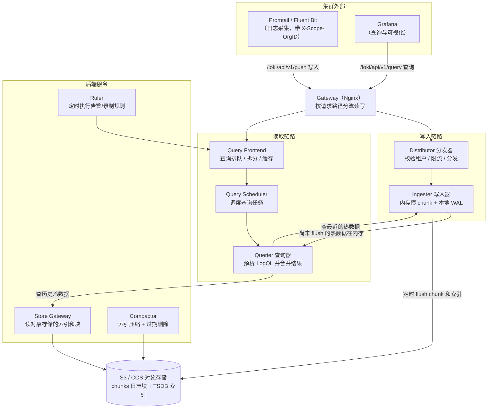

## 可观测性系统介绍（OpenTelemetry）
**可观测性系统有三大支柱**
- 日志（Logs）：带时间戳的离散事件记录，描述"某个时刻发生了什么"，信息最详细但数据量最大，适合排查具体问题。
- 指标（Metrics）：可聚合的数值型数据（如 QPS、延迟、CPU 使用率），描述"系统整体状态如何"，存储成本低、适合告警和趋势分析。
- 跟踪（Traces）：一次请求在多个服务间的完整调用链路，描述"请求经过了哪里、卡在哪一跳"，是微服务排障的关键。

三者互补：指标负责发现异常（告警），日志负责查看细节，链路负责定位跨服务瓶颈。

**OpenTelemetry（OTel）** 是 CNCF 推出的厂商中立标准，统一了三大支柱数据的采集 API、SDK 和协议（OTLP），让应用只需埋点一次，即可导出到任意后端（Jaeger、Prometheus、Loki 等），避免被单一厂商锁定。  


## 部署Loki和grafana
首先通过Terraform将公有云的虚拟机拉起，构建一个k3s集群（或者使用k8s集群）。  
Loki 是 Grafana Labs 推出的日志聚合系统，定位类似 Prometheus，但只处理日志；Promtail 是官方的日志采集 Agent；Grafana 负责可视化查询。三者关系：**Promtail 采集 → Loki 存储/索引 → Grafana 查询展示**。   

### 添加Grafana Helm仓库
```bash
helm repo add grafana https://grafana.github.io/helm-charts
helm repo update
```
创建统一的命名空间：
```bash
kubectl create namespace loki-stack
```

### 安装Loki
编写 `loki.values.yaml`：
```yaml
deploymentMode: SingleBinary
loki:
  querier:
    multi_tenant_queries_enabled: true
  commonConfig:
    replication_factor: 1
  storage:
    bucketNames:
      chunks: loki-1301578102
      ruler: loki-1301578102
      admin: loki-1301578102
    type: s3
    s3:
      endpoint: cos.ap-hongkong.myqcloud.com
      region: ap-hongkong
      secretAccessKey: <your-secret-access-key>   # 密钥别写进配置文件，用环境变量或 CI 凭证注入
      accessKeyId: <your-access-key-id>
  schemaConfig:
    configs:
      - from: "2026-09-01"   
        store: tsdb         #生产环境建议开启tsdb，采用新的索引格式，查询更快，内存占用更低
        index:
          prefix: loki_index_
          period: 24h        # 索引每24h滚动一个新周期（只是切分，不是删除）
        object_store: s3
        schema: v13
  # 日志保留策略：period只负责切分索引，过期删除需要单独开启compactor
  compactor:
    retention_enabled: true        # 开启保留期删除
    retention_delete_delay: 2h      # 标记删除后延迟2h再物理删除，给误删留缓冲
    delete_request_store: s3        # 删除请求记录存放到对象存储
  limitsConfig:
    retention_period: 720h          # 只保留最近30天（30×24h），过期的索引和日志块自动删除
singleBinary:
  replicas: 1
read:
  replicas: 0
backend:
  replicas: 0
write:
  replicas: 0
```

安装：
```bash
helm install loki grafana/loki -n loki-stack -f loki.values.yaml
```

### 日志轮转
日志轮转要分三层看，各层由不同组件负责，不要混为一谈：
| 层级               | 日志内容                                          | 谁负责轮转/删除                                                                  |
| ------------------ | ------------------------------------------------- | -------------------------------------------------------------------------------- |
| 容器业务日志       | Pod 写到 stdout/stderr，落到节点 `/var/log/pods/` | kubelet 自动轮转（默认单文件 10Mi、每容器保留 5 个），Promtail 只负责采集        |
| 节点宿主机系统日志 | 内核、SSH 登录、sudo、cron 等                     | rsyslog 负责落盘，logrotate 负责切分压缩，发行版默认已装好并配置，一般无需手动改 |
| Loki 后端存储      | COS 中的 chunk 和索引对象                         | 上面 values 里的 compactor retention，按保留期定期删除                           |
云原生时代业务都容器化跑在 K8s 上，前两层开箱即用，**真正需要主动配置的只有第三层**。注意 `index.period: 24h` 只是**切分**索引（每天滚动一张新表、旧表转只读），并不会删除数据；不开启 compactor，COS 桶会只增不减。上面 values 中的字段含义：

### COS对象存储
 `filesystem`字段（本地存储）只适合 Demo：日志写在 Pod 所在节点的磁盘上，Pod 漂移或节点故障就会丢数据，且磁盘容量有限、无法多副本共享。生产环境一般换成 S3 兼容的对象存储(storage下面写对象存储的配置)，此外云平台上的对象存储的容量几乎是无限的

### 多租户
**实际用处**：一个公司往往只有一套 Loki 集群，但有多个业务线（电商、支付、游戏……），既要共用基础设施省钱，又不希望 A 业务组的人能翻到 B 业务组的日志——既涉及权限边界，也避免相互干扰。多租户就是用**逻辑隔离**解决这个问题：数据物理上存在同一套 Loki 里，但每条日志都带一个"租户"身份，查询时只能取到自己租户的那份。
**隔离原理**：
1. **写入时打标**：Promtail 配置 `tenant_id`，推送日志时把它放进 HTTP 请求头 `X-Scope-OrgID`。Loki 开启 `auth_enabled: true` 后，会把这个 ID 作为日志数据的一部分，连同标签索引、日志块一起存储——相当于每条日志都盖了"属于谁"的章。
2. **查询时鉴权过滤**：Grafana 数据源也必须配置 `X-Scope-OrgID` 请求头。Loki 收到查询请求后，**强制在最内层拼上租户条件**，只在该租户的索引和数据范围内检索，请求方无法通过修改查询语句跨越这个边界。
3. **没带头或头不合法**：请求直接被拒绝（401/400），拿不到任何数据。
**举例**：电商组和支付组各自部署一个 Promtail：
```yaml
# 电商组 Promtail：X-Scope-OrgID = 100
config:
  clients:
    - url: http://loki-gateway/loki/api/v1/push
      tenant_id: 100

# 支付组 Promtail：X-Scope-OrgID = 200
config:
  clients:
    - url: http://loki-gateway/loki/api/v1/push
      tenant_id: 200
```
- 电商组的 Grafana 数据源配置 `X-Scope-OrgID: 100`，即使查询条件写得很宽泛（如 `{namespace=~".+"}`），Loki 也只会返回租户 100 的日志，**支付组（200）的日志在服务端就被过滤掉了，根本不会返回给前端**——这不是"界面上藏起来"，而是查询引擎层面的数据隔离，所以电商组无法绕过。
- 支付组的 Grafana 配 `X-Scope-OrgID: 200`，同理只能看自己的。
- 平台管理员需要跨组排障时，可配置 `X-Scope-OrgID: 100|200` 并在 Loki 端开启多租户联合查询（`multi_tenant_queries_enabled: true`），权限由管理员侧统一控制。

### 安装Promtail
Promtail 以 **DaemonSet** 方式部署，保证每个 Node 节点运行一个实例，自动采集本节点所有 Pod 的日志。

编写 `promtail.values.yaml`：
```yaml
# promtail.values.yaml
config:
  clients:
    - url: http://loki-gateway/loki/api/v1/push   # 推送到 Loki 网关
      tenant_id: 1                                # 租户ID，必须配置，且要与 Grafana 请求头一致
```

安装： 
```bash
#grafana/promtail是仓库名/chart名
helm install promtail grafana/promtail -n loki-stack -f promtail.values.yaml
```

### 安装Grafana
```bash
helm install grafana grafana/grafana -n loki-stack
```

获取管理员密码（用户名默认 `admin`）：
```bash
kubectl get secret --namespace loki-stack grafana -o jsonpath="{.data.admin-password}" | base64 --decode ; echo
```

通过端口转发把 Grafana 暴露到本地：
```bash
kubectl port-forward --namespace loki-stack service/grafana 3000:80
```
浏览器访问 `http://localhost:3000`。

### LogQL查询语言
LogQL 是 Loki 的查询语言，语法由两部分组成：

**1）日志流选择器**：通过标签（K8s 工作负载 label 自动生成）圈定日志流范围，标签匹配符有 4 种：
- `=`：标签等于，如 `{app="loki"}`
- `!=`：标签不等于
- `=~`：标签正则匹配，如 `{app=~"loki|promtail"}`
- `!~`：标签正则排除

**2）日志管道操作符**：在选中的日志流内逐行过滤：
- `|=`：包含匹配，如 `{app="loki"} |= "metrics.go"`
- `!=`：排除包含关键字的日志行
- `|~`：正则包含，如 `{app="loki"} |~ "error|warn"`
- `!~`：正则排除

### 结构化日志与进阶查询
业务日志建议直接输出**结构化格式**，常见两种：
- **Logfmt**：`level=info ts=2023-11-05T08:26:20Z path=/api/users duration=200ms status=200`
- **JSON**：`{"path":"/api/users","duration":"200ms","status":"200"}`
结构化之后才能针对**字段值**做精确筛选和数值运算，原始非结构化文本只能做关键字 grep。

**用解析器提取字段**：
```sql
{app="loki"} |= "metrics.go" | logfmt | duration > 10ms
{app="loki"} | json | status=200
```

**重写日志输出格式**（必须先经过解析器）：
```sql
#重写后，单个日志内容只包括状态码和耗时
{app="loki"} |= "metrics.go" | logfmt | line_format "{{.status}} {{.duration}}"   
```

**从日志直接算指标**：
```sql
quantile_over_time(0.99,
  {app="loki"} |= "metrics.go" | logfmt | unwrap duration(duration) [1m]
) by (status)
```
- `unwrap duration(duration)` 把 `duration` 字段从文本转为可计算的时长样本。
- `quantile_over_time(0.99, ... [1m])` 计算 1 分钟窗口内的 TP99（99% 的请求在该耗时内完成），`by (status)` 按状态码分组，Grafana 自动画出 200/500 各自的耗时曲线。
- 业务价值：无需额外埋点，靠日志就能监控 API 性能。也可换成 0.95 等分位数或调整时间窗口。


## Loki日志采集原理
### Pod日志存在哪里
K8s 中所有 Pod 写到 stdout/stderr 的内容，会被容器运行时（Docker/containerd）自动落到宿主机的日志目录`/var/log/pods/*`
### Promtail如何采集到这些日志
Promtail 以 DaemonSet（确保每个节点上都恰好运行一个该 Pod 的副本） 部署后，通过 **hostPath** 将自己的目录文件挂载到宿主机的`/var/log/pods/`,也就是写进宿主机`/var/log/pods/`的日志其实是写到Promtail这个容器的`/var/log/pods`目录下了。
```yaml
volumeMounts:
  - name: pods
    mountPath: /var/log/pods
    readOnly: true            # 只读挂载，只采集不修改
volumes:
  - name: pods
    hostPath:
      path: /var/log/pods
```
同时还会挂载 `/var/lib/docker/containers` 等目录以获取容器元数据（用于自动打上 app、namespace、node 等标签）。

### 完整数据流
```
Pod stdout/stderr
  → 节点 /var/log/pods/**/0.log
  → Promtail（DaemonSet，类似 tail -f 持续读新行）
  → HTTP POST  http://loki-gateway/loki/api/v1/push
  → Loki（建立标签索引 + 存储日志块）
  → Grafana 调用 Loki Query 接口查询展示
```
多租户隔离靠 Promtail 配置里的 `tenant_id` 实现，它最终体现在推送请求的 `X-Scope-OrgID` 头上。排查采集问题时，可以先到节点上 `ls /var/log/pods` 确认源头日志是否正常生成。
### Loki为什么轻量且成本低
- **只索引元数据，不做全文索引**：Loki 仅对时间戳和 Labels 建索引，日志正文以压缩块（chunk）原样存储。
- **存储成本极低**：相比 ELK/EFK 对全部文本做倒排索引，Loki 通常可节省约 90% 的存储空间，内存占用也更低。
- **查询分两步**：先用标签（Prometheus 风格的 key-value，如 `{app="loki", container="loki", job="loki-stack/loki"}`）快速定位日志流，再在少量匹配的流内做关键字 grep，而不是全局检索。
- 代价是**不擅长任意文本的全文检索**，因此要求日志带规范标签、正文尽量结构化。
### Loki的核心组件
Loki 的组件按**写入链路、读取链路、后端服务**三组划分。所有组件用的是同一个镜像，只是启动参数 `-target` 不同；单片模式下它们全部运行在一个进程里。

各组件作用：
- **Gateway（网关）**：一个 Nginx，按 URL 把写入请求（`/push`）转发给 Distributor、查询请求转发给 Query Frontend，是外部访问 Loki 的唯一入口。
- **Distributor（分发器）**：写入链路第一站，无状态。负责校验 `X-Scope-OrgID` 租户、限流、把日志按一致性哈希分发到多个 Ingester。
- **Ingester（写入器）**：有状态。接收日志后先在内存中攒成 chunk，并写一份本地 WAL 防宕机丢失；攒够一批或超时后 flush 成 chunk 对象和索引写入对象存储。**查询最近的"热数据"直接问它要**，不用访问对象存储。
- **Querier（查询器）**：无状态。解析 LogQL，同时向 Ingester 查内存中的热数据、向 Store Gateway 查对象存储中的历史冷数据，两边结果合并后返回。
- **Query Frontend（查询前端）**：无状态。负责查询排队、按时间范围拆分大查询、失败重试和结果缓存，避免慢查询把集群拖垮。
- **Query Scheduler（查询调度器）**：维护查询队列，把 Frontend 拆出的子任务公平地分发给空闲 Querier。
- **Store Gateway（存储网关）**：有状态。专门负责从对象存储读取 TSDB 索引和 chunk，并做本地磁盘缓存，让 Querier 不必各自直接访问 S3。
- **Compactor（压缩器）**：做索引合并压缩以加速查询，并执行前面配置的 retention 策略，定期删除过期的 chunk 和索引。
- **Ruler（规则器）**：定时执行 LogQL 告警规则和录制规则，结果推送到 Alertmanager。
- **对象存储（S3/COS）**：所有 chunk 日志块和 TSDB 索引的最终持久化位置，组件本地磁盘上只有 WAL 和缓存这类可重建的临时数据。

### Loki的三种架构
#### 单片模式
- 通过-target=all命令以单片模式启动
- 单个进程内以二进制文件方式运行所有核心组件
- 每天最多支持20GB左右的日志读写量，适合demo
#### 简单可扩展模式
- 写入组件和读取组件可独立部署和扩展，需要部署反向代理(Nginx)分发读写请求
- 所有组件使用相同镜像，通过启动参数区分功能-target=write: 启动写入组件(有状态)-target=read: 启动读取组件(无状态)-target=backend: 启动后端服务组件(有状态)
- 适用于每天几TB级别的日志量
- 默认包含Gateway(Nginx)负责请求分发
#### 微服务架构
- 所有组件单独部署，每个组件都可独立扩展
- 可通过Helm Chart配置实现微服务部署
- 通过-target=参数精确指定每个服务的功能
- 适用于每天日志量超过10TB的超大规模场景

