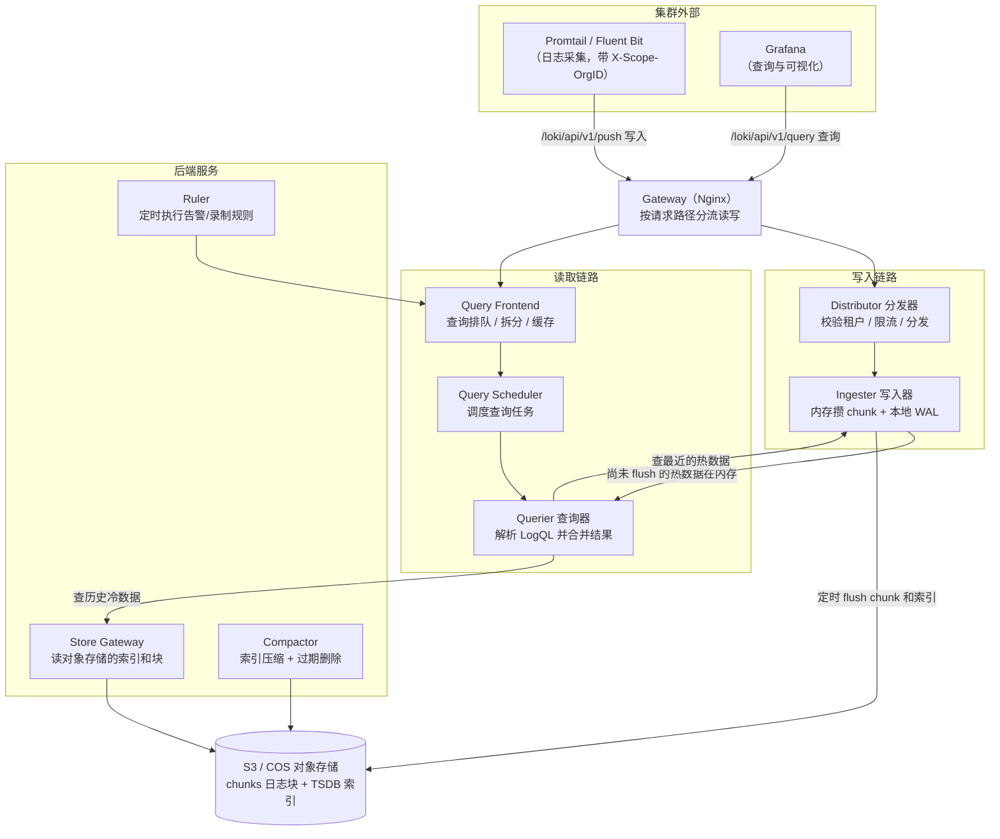
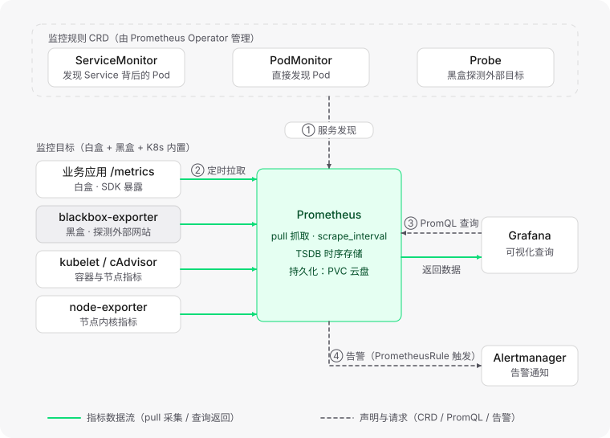
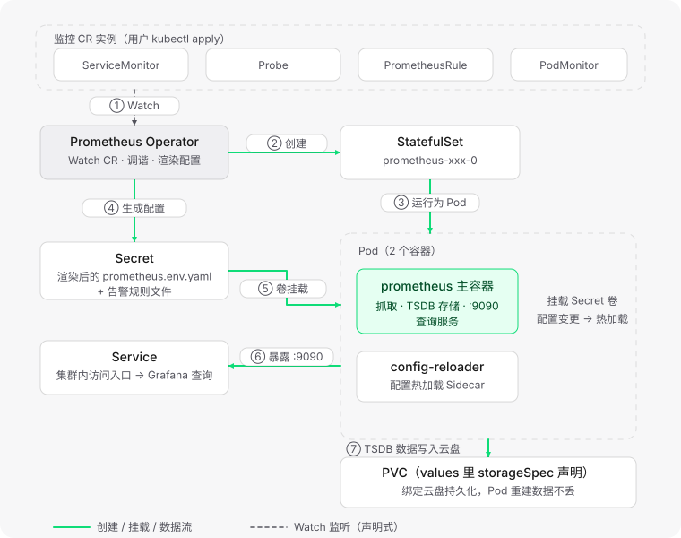

## 可观测性系统介绍（OpenTelemetry）
**可观测性系统有三大支柱**
- 日志（Logs）：带时间戳的离散事件记录，描述"某个时刻发生了什么"，信息最详细但数据量最大，适合排查具体问题。
- 指标（Metrics）：可聚合的数值型数据（如 QPS、延迟、CPU 使用率），描述"系统整体状态如何"，存储成本低、适合告警和趋势分析。
- 跟踪（Traces）：一次请求在多个服务间的完整调用链路，描述"请求经过了哪里、卡在哪一跳"，是微服务排障的关键。

三者互补：指标负责发现异常（告警），日志负责查看细节，链路负责定位跨服务瓶颈。

**OpenTelemetry（OTel）** 是 CNCF 推出的厂商中立标准，统一了三大支柱数据的采集 API、SDK 和协议（OTLP），让应用只需埋点一次，即可导出到任意后端（Jaeger、Prometheus、Loki 等），避免被单一厂商锁定。  


## 部署Loki和grafana
首先通过Terraform将公有云的虚拟机拉起，构建一个k3s集群（或者使用k8s集群）。  
Loki 是 Grafana Labs 推出的日志聚合系统，定位类似 Prometheus，但只处理日志；Promtail 是官方的日志采集 Agent；Grafana 负责可视化查询。三者关系：**Promtail 采集 → Loki 存储/索引 → Grafana 查询展示**。   

### 添加Grafana Helm仓库
```bash
helm repo add grafana https://grafana.github.io/helm-charts
helm repo update
```
创建统一的命名空间：
```bash
kubectl create namespace loki-stack
```

### 安装Loki
编写 `loki.values.yaml`：
```yaml
deploymentMode: SingleBinary
loki:
  querier:
    multi_tenant_queries_enabled: true
  commonConfig:
    replication_factor: 1
  storage:
    bucketNames:
      chunks: loki-1301578102
      ruler: loki-1301578102
      admin: loki-1301578102
    type: s3
    s3:
      endpoint: cos.ap-hongkong.myqcloud.com
      region: ap-hongkong
      secretAccessKey: <your-secret-access-key>  
      accessKeyId: <your-access-key-id>
  schemaConfig:
    configs:
      - from: "2026-09-01"   
        store: tsdb         #生产环境建议开启tsdb，采用新的索引格式，查询更快，内存占用更低
        index:
          prefix: loki_index_
          period: 24h        # 索引每24h滚动一个新周期（只是切分，不是删除）
        object_store: s3
        schema: v13
  # 日志保留策略：period只负责切分索引，过期删除需要单独开启compactor
  compactor:
    retention_enabled: true        # 开启保留期删除
    retention_delete_delay: 2h      # 标记删除后延迟2h再物理删除，给误删留缓冲
    delete_request_store: s3        # 删除请求记录存放到对象存储
  limitsConfig:
    retention_period: 720h          # 只保留最近30天（30×24h），过期的索引和日志块自动删除
singleBinary:
  replicas: 1
read:
  replicas: 0
backend:
  replicas: 0
write:
  replicas: 0
```

安装：
```bash
helm install loki grafana/loki -n loki-stack -f loki.values.yaml
```

### 日志轮转
日志轮转要分三层看，各层由不同组件负责，不要混为一谈：
| 层级               | 日志内容                                          | 谁负责轮转/删除                                                                  |
| ------------------ | ------------------------------------------------- | -------------------------------------------------------------------------------- |
| 容器业务日志       | Pod 写到 stdout/stderr，落到节点 `/var/log/pods/` | kubelet 自动轮转（默认单文件 10Mi、每容器保留 5 个），Promtail 只负责采集        |
| 节点宿主机系统日志 | 内核、SSH 登录、sudo、cron 等                     | rsyslog 负责落盘，logrotate 负责切分压缩，发行版默认已装好并配置，一般无需手动改 |
| Loki 后端存储      | COS 中的 chunk 和索引对象                         | 上面 values 里的 compactor retention，按保留期定期删除                           |
云原生时代业务都容器化跑在 K8s 上，前两层开箱即用，**真正需要主动配置的只有第三层**。注意 `index.period: 24h` 只是**切分**索引（每天滚动一张新表、旧表转只读），并不会删除数据；不开启 compactor，COS 桶会只增不减。上面 values 中的字段含义：

### COS对象存储
 `filesystem`字段（本地存储）只适合 Demo：日志写在 Pod 所在节点的磁盘上，Pod 漂移或节点故障就会丢数据，且磁盘容量有限、无法多副本共享。生产环境一般换成 S3 兼容的对象存储(storage下面写对象存储的配置)，此外云平台上的对象存储的容量几乎是无限的

### 多租户
**实际用处**：一个公司往往只有一套 Loki 集群，但有多个业务线（电商、支付、游戏……），既要共用基础设施省钱，又不希望 A 业务组的人能翻到 B 业务组的日志——既涉及权限边界，也避免相互干扰。多租户就是用**逻辑隔离**解决这个问题：数据物理上存在同一套 Loki 里，但每条日志都带一个"租户"身份，查询时只能取到自己租户的那份。
**隔离原理**：
1. **写入时打标**：Promtail 配置 `tenant_id`，推送日志时把它放进 HTTP 请求头 `X-Scope-OrgID`。Loki 开启 `auth_enabled: true` 后，会把这个 ID 作为日志数据的一部分，连同标签索引、日志块一起存储——相当于每条日志都盖了"属于谁"的章。
2. **查询时鉴权过滤**：Grafana 数据源也必须配置 `X-Scope-OrgID` 请求头。Loki 收到查询请求后，**强制在最内层拼上租户条件**，只在该租户的索引和数据范围内检索，请求方无法通过修改查询语句跨越这个边界。
3. **没带头或头不合法**：请求直接被拒绝（401/400），拿不到任何数据。
**举例**：电商组和支付组各自部署一个 Promtail：
```yaml
# 电商组 Promtail：X-Scope-OrgID = 100
config:
  clients:
    - url: http://loki-gateway/loki/api/v1/push
      tenant_id: 100

# 支付组 Promtail：X-Scope-OrgID = 200
config:
  clients:
    - url: http://loki-gateway/loki/api/v1/push
      tenant_id: 200
```
- 电商组的 Grafana 数据源配置 `X-Scope-OrgID: 100`，即使查询条件写得很宽泛（如 `{namespace=~".+"}`），Loki 也只会返回租户 100 的日志，**支付组（200）的日志在服务端就被过滤掉了，根本不会返回给前端**——这不是"界面上藏起来"，而是查询引擎层面的数据隔离，所以电商组无法绕过。
- 支付组的 Grafana 配 `X-Scope-OrgID: 200`，同理只能看自己的。
- 平台管理员需要跨组排障时，可配置 `X-Scope-OrgID: 100|200` 并在 Loki 端开启多租户联合查询（`multi_tenant_queries_enabled: true`），权限由管理员侧统一控制。

### 安装Promtail
Promtail 以 **DaemonSet** 方式部署，保证每个 Node 节点运行一个实例，自动采集本节点所有 Pod 的日志。

编写 `promtail.values.yaml`：
```yaml
# promtail.values.yaml
config:
  clients:
    - url: http://loki-gateway/loki/api/v1/push   # 推送到 Loki 网关
      tenant_id: 1                                # 租户ID，必须配置，且要与 Grafana 请求头一致
```

安装： 
```bash
#grafana/promtail是仓库名/chart名
helm install promtail grafana/promtail -n loki-stack -f promtail.values.yaml
```

### 安装Grafana
```bash
helm install grafana grafana/grafana -n loki-stack
```

获取管理员密码（用户名默认 `admin`）：
```bash
kubectl get secret --namespace loki-stack grafana -o jsonpath="{.data.admin-password}" | base64 --decode ; echo
```

通过端口转发把 Grafana 暴露到本地：
```bash
kubectl port-forward --namespace loki-stack service/grafana 3000:80
```
浏览器访问 `http://localhost:3000`。

### LogQL查询语言
LogQL 是 Loki 的查询语言，语法由两部分组成：

**1）日志流选择器**：通过标签（K8s 工作负载 label 自动生成）圈定日志流范围，标签匹配符有 4 种：
- `=`：标签等于，如 `{app="loki"}`
- `!=`：标签不等于
- `=~`：标签正则匹配，如 `{app=~"loki|promtail"}`
- `!~`：标签正则排除

**2）日志管道操作符**：在选中的日志流内逐行过滤：
- `|=`：包含匹配，如 `{app="loki"} |= "metrics.go"`
- `!=`：排除包含关键字的日志行
- `|~`：正则包含，如 `{app="loki"} |~ "error|warn"`
- `!~`：正则排除

### 结构化日志与进阶查询
业务日志建议直接输出**结构化格式**，常见两种：
- **Logfmt**：`level=info ts=2023-11-05T08:26:20Z path=/api/users duration=200ms status=200`
- **JSON**：`{"path":"/api/users","duration":"200ms","status":"200"}`
结构化之后才能针对**字段值**做精确筛选和数值运算，原始非结构化文本只能做关键字 grep。

**用解析器提取字段**：
```sql
{app="loki"} |= "metrics.go" | logfmt | duration > 10ms
{app="loki"} | json | status=200
```

**重写日志输出格式**（必须先经过解析器）：
```sql
#重写后，单个日志内容只包括状态码和耗时
{app="loki"} |= "metrics.go" | logfmt | line_format "{{.status}} {{.duration}}"   
```

**从日志直接算指标**：
```sql
quantile_over_time(0.99,
  {app="loki"} |= "metrics.go" | logfmt | unwrap duration(duration) [1m]
) by (status)
```
- `unwrap duration(duration)` 把 `duration` 字段从文本转为可计算的时长样本。
- `quantile_over_time(0.99, ... [1m])` 计算 1 分钟窗口内的 TP99（99% 的请求在该耗时内完成），`by (status)` 按状态码分组，Grafana 自动画出 200/500 各自的耗时曲线。
- 业务价值：无需额外埋点，靠日志就能监控 API 性能。也可换成 0.95 等分位数或调整时间窗口。


## Loki日志采集原理
### Pod日志存在哪里
K8s 中所有 Pod 写到 stdout/stderr 的内容，会被容器运行时（Docker/containerd）自动落到宿主机的日志目录`/var/log/pods/*`
### Promtail如何采集到这些日志
Promtail 以 DaemonSet（确保每个节点上都恰好运行一个该 Pod 的副本） 部署后，通过 **hostPath** 将自己的目录文件挂载到宿主机的`/var/log/pods/`,也就是写进宿主机`/var/log/pods/`的日志其实是写到Promtail这个容器的`/var/log/pods`目录下了。
```yaml
volumeMounts:
  - name: pods
    mountPath: /var/log/pods
    readOnly: true            # 只读挂载，只采集不修改
volumes:
  - name: pods
    hostPath:
      path: /var/log/pods
```
同时还会挂载 `/var/lib/docker/containers` 等目录以获取容器元数据（用于自动打上 app、namespace、node 等标签）。

### 完整数据流
```
Pod stdout/stderr
  → 节点 /var/log/pods/**/0.log
  → Promtail（DaemonSet，类似 tail -f 持续读新行）
  → HTTP POST  http://loki-gateway/loki/api/v1/push
  → Loki（建立标签索引 + 存储日志块）
  → Grafana 调用 Loki Query 接口查询展示
```
多租户隔离靠 Promtail 配置里的 `tenant_id` 实现，它最终体现在推送请求的 `X-Scope-OrgID` 头上。排查采集问题时，可以先到节点上 `ls /var/log/pods` 确认源头日志是否正常生成。
### Loki为什么轻量且成本低
- **只索引元数据，不做全文索引**：Loki 仅对时间戳和 Labels 建索引，日志正文以压缩块（chunk）原样存储。
- **存储成本极低**：相比 ELK/EFK 对全部文本做倒排索引，Loki 通常可节省约 90% 的存储空间，内存占用也更低。
- **查询分两步**：先用标签（Prometheus 风格的 key-value，如 `{app="loki", container="loki", job="loki-stack/loki"}`）快速定位日志流，再在少量匹配的流内做关键字 grep，而不是全局检索。
- 代价是**不擅长任意文本的全文检索**，因此要求日志带规范标签、正文尽量结构化。
### Loki的核心组件
Loki 的组件按**写入链路、读取链路、后端服务**三组划分。所有组件用的是同一个镜像，只是启动参数 `-target` 不同；单片模式下它们全部运行在一个进程里。

```mermaid
flowchart TD
    subgraph EXT [集群外部]
        P["Promtail / Fluent Bit<br/>（日志采集，带 X-Scope-OrgID）"]
        G["Grafana<br/>（查询与可视化）"]
    end

    GW["Gateway（Nginx）<br/>按请求路径分流读写"]

    subgraph WRITE [写入链路]
        D["Distributor 分发器<br/>校验租户 / 限流 / 分发"]
        I["Ingester 写入器<br/>内存攒 chunk + 本地 WAL"]
    end

    subgraph READ [读取链路]
        QF["Query Frontend<br/>查询排队 / 拆分 / 缓存"]
        QS["Query Scheduler<br/>调度查询任务"]
        Q["Querier 查询器<br/>解析 LogQL 并合并结果"]
    end

    subgraph BACKEND [后端服务]
        SG["Store Gateway<br/>读对象存储的索引和块"]
        C["Compactor<br/>索引压缩 + 过期删除"]
        R["Ruler<br/>定时执行告警/录制规则"]
    end

    OBJ[("S3 / COS 对象存储<br/>chunks 日志块 + TSDB 索引")]

    P -->|"/loki/api/v1/push 写入"| GW --> D --> I
    I -->|尚未 flush 的热数据在内存| Q
    I -->|定时 flush chunk 和索引| OBJ
    G -->|"/loki/api/v1/query 查询"| GW --> QF --> QS --> Q
    Q -->|查最近的热数据| I
    Q -->|查历史冷数据| SG --> OBJ
    C --> OBJ
    R --> QF
```
各组件作用：
- **Gateway（网关）**：一个 Nginx，按 URL 把写入请求（`/push`）转发给 Distributor、查询请求转发给 Query Frontend，是外部访问 Loki 的唯一入口。
- **Distributor（分发器）**：写入链路第一站，无状态。负责校验 `X-Scope-OrgID` 租户、限流、把日志按一致性哈希分发到多个 Ingester。
- **Ingester（写入器）**：有状态。接收日志后先在内存中攒成 chunk，并写一份本地 WAL 防宕机丢失；攒够一批或超时后 flush 成 chunk 对象和索引写入对象存储。**查询最近的"热数据"直接问它要**，不用访问对象存储。
- **Querier（查询器）**：无状态。解析 LogQL，同时向 Ingester 查内存中的热数据、向 Store Gateway 查对象存储中的历史冷数据，两边结果合并后返回。
- **Query Frontend（查询前端）**：无状态。负责查询排队、按时间范围拆分大查询、失败重试和结果缓存，避免慢查询把集群拖垮。
- **Query Scheduler（查询调度器）**：维护查询队列，把 Frontend 拆出的子任务公平地分发给空闲 Querier。
- **Store Gateway（存储网关）**：有状态。专门负责从对象存储读取 TSDB 索引和 chunk，并做本地磁盘缓存，让 Querier 不必各自直接访问 S3。
- **Compactor（压缩器）**：做索引合并压缩以加速查询，并执行前面配置的 retention 策略，定期删除过期的 chunk 和索引。
- **Ruler（规则器）**：定时执行 LogQL 告警规则和录制规则，结果推送到 Alertmanager。
- **对象存储（S3/COS）**：所有 chunk 日志块和 TSDB 索引的最终持久化位置，组件本地磁盘上只有 WAL 和缓存这类可重建的临时数据。

### Loki的三种架构
#### 单片模式
- 通过-target=all命令以单片模式启动
- 单个进程内以二进制文件方式运行所有核心组件
- 每天最多支持20GB左右的日志读写量，适合demo
#### 简单可扩展模式
- 写入组件和读取组件可独立部署和扩展，需要部署反向代理(Nginx)分发读写请求
- 所有组件使用相同镜像，通过启动参数区分功能-target=write: 启动写入组件(有状态)-target=read: 启动读取组件(无状态)-target=backend: 启动后端服务组件(有状态)
- 适用于每天几TB级别的日志量
- 默认包含Gateway(Nginx)负责请求分发
#### 微服务架构
- 所有组件单独部署，每个组件都可独立扩展
- 可通过Helm Chart配置实现微服务部署
- 通过-target=参数精确指定每个服务的功能
- 适用于每天日志量超过10TB的超大规模场景


## 部署Prometheus
上文 Loki 解决了**日志**这一支柱，接下来用 Prometheus 解决**指标**。

### K8s系统级指标从哪来
先搞清楚监控数据的源头。容器指标的采集链路是固定的：

```
容器运行时 → cAdvisor → kubelet → metrics-server → API Server → HPA / kubectl top
```

- **cAdvisor**：内置在 kubelet 中，负责收集、聚合、导出容器运行时指标
- **kubelet**：通过 `/metrics/resource` 和 `/stats` 端点暴露指标，提供 Summary API
- **metrics-server**：独立附加组件，聚合指标后提供 Metrics API，供 HPA 扩缩容和 `kubectl top` 消费

这些端点手动就能访问，可以先直观感受一下。启动本地代理后：
```bash
#因为kubectl没有对应获取这些指标的命令，所有只能采取这个方式
kubectl proxy   # 默认监听 127.0.0.1:8001
# 1. cAdvisor 指标 —— 容器级别的细节指标
curl http://127.0.0.1:8001/api/v1/nodes/node1/proxy/metrics/cadvisor
# 2. 资源使用指标 —— kubectl top 和 HPA 用的那份
curl http://127.0.0.1:8001/api/v1/nodes/node1/proxy/metrics/resource
# 3. 健康检查指标 —— 探针执行的耗时统计
curl http://127.0.0.1:8001/api/v1/nodes/node1/proxy/metrics/probes
```
输出全是 Prometheus 格式文本，**重点指标**：
- `container_cpu_usage_seconds_total`：CPU 使用时间（Counter 类型，通过 rate 算出使用率）
- `container_memory_working_set_bytes`：内存工作集——**这是 OOM 判断依据**，超过 limit 即被驱逐
- `container_start_time_seconds` / `container_last_seen`：容器启动时间与最后可见时间
- `prober_probe_duration_seconds`：按 Liveness/Readiness 分类统计的探针耗时

### 手动配置抓取有多复杂
Prometheus 想抓到这些指标，需要：`kubernetes_sd_configs` 服务发现、Bearer Token 认证、TLS 配置、relabel 标签重写……从零手写 scrape 配置繁琐且难维护，K8s 上一般不这么干，而是使用 **Prometheus Operator**。

### Prometheus Operator：用CRD管理监控
通过 CRD 把 Prometheus 和 Alertmanager 也变成 K8s 资源，并通过标签选择器自动发现监控目标，无需手写服务发现和认证配置。
| CRD                                              | 作用                                                                                                  |
| ------------------------------------------------ | ----------------------------------------------------------------------------------------------------- |
| `Prometheus` / `Alertmanager`                    | 部署类，以 StatefulSet 形式运行                                                                       |
| `ServiceMonitor`                                 | 声明要监控的 Service（有 Service 时首选,通过 ServiceMonitor背后所有健康 Pod 的 IP 列表,绕过负载均衡， |
| 直接对每个 Pod 的 IP:port 分别发 /metrics 请求） |
| `PodMonitor`                                     | 直接监控 Pod（无 Service 的 Job/DaemonSet 场景）                                                      |
| `Probe`                                          | 黑盒探测 Ingress 或静态目标                                                                           |
| `PrometheusRule`                                 | 告警/录制规则                                                                                         |
| `AlertmanagerConfig`                             | 自定义告警路由                                                                                        |

### 安装kube-prometheus-stack
[kube-prometheus-stack](https://github.com/prometheus-community/helm-charts/tree/main/charts/kube-prometheus-stack) 是 Prometheus Operator 的开箱即用全家桶：预置了 K8s 常用指标的抓取策略、relabel 规则和告警规则，并附带 kube-state-metrics（导出工作负载指标）、node-exporter（导出节点内核级指标）等组件。  
**注意**：它默认捆绑安装一套 Grafana，而上文已经装过 Grafana 了，直接复用即可，把捆绑的关掉。编写 `prometheus.values.yaml`：
```yaml
grafana:
  enabled: false    # 复用上文已装的 Grafana，关闭捆绑的

prometheus:
  prometheusSpec:
    # 默认只认 Helm release 标签匹配的 CRD，跨 release / 手动部署的
    # ServiceMonitor、Probe 会不生效——这是最常见的坑
    serviceMonitorSelectorNilUsesHelmValues: false
    podMonitorSelectorNilUsesHelmValues: false
    probeSelectorNilUsesHelmValues: false
    retention: 7d                     # 指标本地只保留7天
    storageSpec:                      # 持久化，避免重启丢指标
      volumeClaimTemplate:
        spec:
          storageClassName: cbs
          resources:
            requests:
              storage: 10Gi
    externalLabels:
      cluster: k3s-demo               # 多集群场景打标，区分指标来源
```
安装：
```bash
helm repo add prometheus-community https://prometheus-community.github.io/helm-charts
helm repo update
helm upgrade -i kube-prometheus-stack prometheus-community/kube-prometheus-stack \
  -n monitoring --create-namespace -f prometheus.values.yaml
```
接入上文已装的 Grafana：在数据源设置里添加 Prometheus，URL 指向集群内服务：
```text
http://kube-prometheus-stack-kube-prom-prometheus.monitoring:9090
```
验证：端口转发后访问 Prometheus UI，**Status → Targets** 查看抓取目标是否 UP，**Service Discovery** 页面可确认各 ServiceMonitor/Probe 的活跃目标数量。再导入官方预置 Dashboard（如 Node Exporter/Nodes、Prometheus/Overview），开箱即得集群/节点/工作负载监控视图。

### 黑盒监控：网站可用性
白盒监控是应用自己暴露 `/metrics` 让 Prometheus 来抓；**黑盒监控则站在用户视角，从外部探测服务"活不活"**——即使应用内部一切正常，DNS 故障、证书过期、网关挂掉都会导致用户访问失败，这类问题只有黑盒才能发现。

安装 blackbox-exporter：
```bash
helm upgrade -i blackbox-exporter prometheus-community/prometheus-blackbox-exporter \
  -n monitoring --create-namespace --version 9.0.1
```

通过 **Probe CRD** 声明要探测的网站：
```yaml
apiVersion: monitoring.coreos.com/v1
kind: Probe
metadata:
  name: http-probe
  namespace: monitoring
  labels:
    release: kube-prometheus-stack   # 必须与 Prometheus 的 probeSelector 匹配
spec:
  interval: 10s                      # 探测间隔
  module: http_200                  # 检测模块：HTTP 返回 200 视为存活
  prober:
    url: blackbox-exporter-prometheus-blackbox-exporter.monitoring:9115  # exporter 地址
  targets:
    staticConfig:
      static:
        - https://example.com
        - https://www.infoq.com
```

**工作原理**（重点）：exporter 不存任何数据，只是"替 Prometheus 跑腿"去实际访问目标：
```
Prometheus →（携带 module + target 参数请求 /probe）
  → blackbox-exporter 实际访问目标网站，收集探测指标
  → 结果经 /metrics 返回，Prometheus 抓取存储
```
relabel 会把 `__param_target` 复制为 `instance` 标签，方便按目标网站查询。关键指标：`probe_http_status_code`（状态码）、`probe_duration_seconds`（探针耗时）、`probe_ssl_earliest_cert_expiry`（**SSL 证书过期时间**，可做提前告警）。

### 白盒监控：业务指标埋点
应用引入 Prometheus SDK，暴露 `/metrics` 端点供抓取。四种指标类型：

| 类型          | 用途         | 特点                                       | 典型场景             |
| ------------- | ------------ | ------------------------------------------ | -------------------- |
| **Counter**   | 累计值       | 只增不减                                   | 请求总数、错误总数   |
| **Gauge**     | 瞬时值       | 可增可减                                   | 内存使用量、队列长度 |
| **Histogram** | 数据分布     | 自动分桶（`_bucket` + `le`），可跨实例聚合 | 响应时间             |
| **Summary**   | 预定义分位数 | 客户端算好分位数，**不可跨实例聚合**       | 单实例精确分位数     |

让 Prometheus 抓到业务指标——部署 **ServiceMonitor**（重点）：
```yaml
apiVersion: monitoring.coreos.com/v1
kind: ServiceMonitor
metadata:
  name: go-app
  namespace: monitoring
  labels:
    release: kube-prometheus-stack   # 必须匹配，否则 Operator 不认（最常见的坑）
spec:
  selector:
    matchLabels:
      app: go-app                    # 通过 label 匹配 Service
  endpoints:
    - port: http                     # Service 的端口名（不是端口号）
      path: /metrics                 # 指标接口路径
      interval: 15s                  # 抓取间隔
```
匹配链路：ServiceMonitor 通过 label 选中 Service → 经 Service 的 Endpoints 定位后端 Pod → 抓取 `/metrics`。**选型**：有 Service 用 ServiceMonitor（借助负载均衡一次匹配多个 Pod）；无 Service（Job/DaemonSet）直接用 PodMonitor。团队协作上，工程团队只需保证 `/metrics` 接口，基础设施团队负责 CRD 编写，二者解耦。

抓取生效后，Prometheus 会自动给指标附加 `instance`、`namespace`、`service`、`pod`、`container` 等标签，查询时可按这些维度分组定位，类似日志查询的用法。

### Prometheus+Grafana获取指标流程图



```text
node-exporter（DaemonSet，每个节点一个 Pod）
   挂载宿主机 /proc、/sys 目录 → 读出 CPU、内存、磁盘、网络等内核级数据
      ↓ Prometheus 定时 GET http://<节点IP>:9100/metrics
node_cpu_seconds_total、node_memory_MemAvailable_bytes ...
- - - - - - - - - - - - - - - - - - - - - - - - - - - - - - - - - - - - - - - - - - -
容器运行时（containerd）→ cAdvisor（内嵌在 kubelet 里，采集所有容器指标）
      ↓ kubelet 端点暴露
Prometheus 定时抓 kubelet 的 /metrics/cadvisor、/metrics/resource
      ↓
container_cpu_usage_seconds_total、container_memory_working_set_bytes、node_cpu_usage_seconds_total
- - - - - - - - - - - - - - - - - - - - - - - - - - - - - - - - - - - - - - - - - - -
Probe CRD（声明：探谁、怎么探、谁来探）
      ↓ ① Prometheus 服务发现，把探测目标转成抓取请求
Prometheus → GET http://blackbox-exporter:9115/probe?target=https://xxx.com&module=http_2xx
      ↓ ② exporter 替 Prometheus 真实访问目标网站（DNS→TCP→TLS→HTTP 全流程）
      ↓ ③ 以 /metrics 返回探测结果
probe_http_status_code、probe_duration_seconds、probe_ssl_earliest_cert_expiry
      ↓ Prometheus 像存普通指标一样存储
```

### Prometheus本身等相关资源的关系



`helm install` 之后集群里多出一堆资源，它们各司其职：**CR 实例**（ServiceMonitor/Probe 等）是用户声明的期望；**Operator** Watch 这些 CR，一边**创建 StatefulSet**（进而运行出 Prometheus Pod，内含 prometheus 主容器和 config-reloader Sidecar），一边把 CR **渲染成配置写进 Secret**，Secret 再以卷挂载进 Pod，reloader 检测到变化触发主容器热加载。对外的查询入口是 **Service（:9090）**，供 Grafana 发 PromQL 查询；指标数据则通过 **PVC** 落在云盘上，Pod 重建也不丢。

### PromQL查询指标
PromQL 与 LogQL 语法同源，都是"指标选择器 + 标签选择器"定位数据：

```sql
# 1. 查特定指标
http_request_total{app="go-app"}

# 2. 各接口平均QPS：rate计算1分钟变化速率（适用于Counter），sum by按接口路径分组
sum by(path) (rate(http_request_total[1m]))

# 3. P95延迟：_bucket是直方图分桶数据，le是桶边界
histogram_quantile(0.95,
  sum by (path, le) (rate(http_response_time_seconds_bucket[1m]))
)
```
P95 的执行顺序：取原始分桶数据 → 计算各桶变化速率 → 按桶边界 `le` 聚合 → 用 `histogram_quantile()` 计算 95% 分位。在 Grafana 中可据此创建实时 QPS（Stat 面板）、QPS 趋势（Time series 面板）、总请求数按状态码分组、P95 延迟水位线等面板。

### 直方图的坑
**默认桶的缺陷**：当实际响应时间集中在某小区间时（如 100-200ms），默认桶粒度过粗（如 0-250ms 一档），插值法算出的分位数会明显偏离真实值，甚至超出实际值范围。
**选型建议**：
- 需要跨实例聚合、了解分布范围 → **Histogram**
- 需要精确分位数且不聚合 → **Summary**
- 生产实践中抓取配置不要用 Pod annotation 方式，**优先 ServiceMonitor/PodMonitor**：配置解耦、支持多端口/认证/标签等高级功能


## 集成OTEL SDK
平台侧（Prometheus/Loki/Grafana）已就绪，现在轮到**应用侧**：接入 OpenTelemetry SDK，把三大支柱从应用里交出来，并用 trace_id 把它们缝在一起。分工原则：**组件监控靠配置（K8s 组件天生暴露 /metrics），业务可观测性必须代码埋点**（链路、业务指标、日志关联，配置变不出来）。

### 基础概念：Trace 与 Span
- **Trace**：一次请求的完整调用链，用全局唯一的 **trace_id** 标识
- **Span**：链路中的一"跳"（一次 HTTP 调用、一次 DB 查询），有自己的 **span_id**、耗时和状态

**Trace 是树，Span 是树上的节点，trace_id 是这棵树的根标签。** 以请求穿过三个服务为例：

```text
用户请求 app-a 的 /chain
│
├─ trace_id: e981ea46f9...（全程不变）
│
├─ Span A1: GET /chain（app-a）            ← 根 Span
│    ├─ Span A2: httpx 调用 app-b
│    │    └─ Span B1: GET /cpu_task（app-b）  ← 瀑布图上一眼看出瓶颈
│    └─ Span A3: httpx 调用 app-c
│         └─ Span C1: GET /io_task（app-c）
```

三个关键机制：
- **全程同一个 trace_id**：请求经过的所有服务的所有 Span 都带它——所以在 app-c 的日志里能查到"这次请求在 app-a 里长什么样"
- **span_id + parent_span_id 还原树形**：每个 Span 指向自己的父跳，Tempo 瀑布图就是按这层关系排出来的
- **跨服务传播靠 HTTP Header 自动完成**：app-a 调 app-b 时，SDK 自动把 trace_id 塞进请求头，无需手写

一句话：**trace_id 回答"是哪次请求"，span_id 回答"是这次请求里的哪一步"**——后文的一切关联都建立在这两个 ID 随请求流动、被各处记录之上。

### 三支柱接入：Traces / Logs / Metrics
以 Python FastAPI 应用为例，OTel 的接入集中在初始化函数里：
```python
from opentelemetry import trace
from opentelemetry.sdk.trace import TracerProvider
from opentelemetry.sdk.trace.export import BatchSpanProcessor
from opentelemetry.exporter.otlp.proto.grpc.trace_exporter import OTLPSpanExporter
from opentelemetry.sdk.resources import Resource
from opentelemetry.instrumentation.fastapi import FastAPIInstrumentor
from opentelemetry.instrumentation.logging import LoggingInstrumentor

def setting_otlp(app, app_name, endpoint):
    # Resource：给所有 Span 打服务身份标签，Tempo 里按它区分服务
    resource = Resource.create(attributes={
        "service.name": app_name,
        "app": app_name,                  # 自定义标签，Grafana 面板筛选用
    })
    # TracerProvider + 批量处理器：Span 攒一批经 OTLP (gRPC)v 推给 Tempo
    provider = TracerProvider(resource=resource)
    provider.add_span_processor(BatchSpanProcessor(OTLPSpanExporter(endpoint=endpoint)))
    trace.set_tracer_provider(provider)

    # 自动埋点：一行生成 HTTP 请求的 Span，无需手写
    FastAPIInstrumentor.instrument_app(app, tracer_provider=provider)
    # 日志关联：自动把 trace_id / span_id 注入每行日志（缝合线①）
    LoggingInstrumentor().instrument(log_correlation=True)
```

服务端点是 Tempo 的 OTLP 接口，通过环境变量注入（同一镜像部署多个服务，靠环境变量区分角色）：
```python
OTLP_GRPC_ENDPOINT = os.environ.get("OTLP_GRPC_ENDPOINT", "http://tempo.monitoring:4317")
```

指标侧沿用前文的埋点思路（prometheus-client 定义 Counter/Histogram + 中间件统一打点），但要多做一件事——**记录指标时把当前 Span 的 TraceID 附上去**：
```python
span = trace.get_current_span()
trace_id = trace.format_trace_id(span.get_span_context().trace_id)
# 随指标样本一并输出 —— 这就是 Exemplar
```

### 缝合线②：Exemplar（指标 → 链路）
Exemplar 是 Prometheus 的机制：**指标样本上附带 TraceID**。Grafana 图表上会显示成小绿点，QPS 尖峰处点一下就直接跳到 Tempo 看那条链路。

**关键前提**：Prometheus 必须显式开启 exemplar 存储，否则 TraceID 会被直接丢弃，指标和链路变成数据孤岛：
```yaml
# kube-prometheus-stack values.yaml
prometheus:
  prometheusSpec:
    enableFeatures:
      - exemplar-storage
```

### 部署与验证：让三支柱的数据流起来
用同一个镜像起三个服务（app-a / app-b / app-c），app-a 的 `/chain` 接口依次调用后两者，模拟真实微服务调用链；再挂一个 siege 压测容器自动打流量造数据。指标照旧用 ServiceMonitor 抓（前文讲过，不再重复）。

部署完成后逐项验证三根支柱：
```text
① 指标：curl /metrics → 每条样本带 TraceID="e981..."（exemplar 生效）
② 日志：应用日志含 trace_id / span_id（LoggingInstrumentor 生效）
③ 链路：Grafana → Tempo 用 TraceQL 查询，看到 app-a → app-b → app-c
        的完整瀑布图，每跳 Span 耗时一目了然
```

至此排障闭环成型：**指标发现异常（P95 尖峰）→ 点 Exemplar 绿点取出慢请求链路（定位卡在哪一跳）→ 从链路跳日志（看到具体报错）**——全程不换工具，这正是开头说的三支柱互补的价值。
