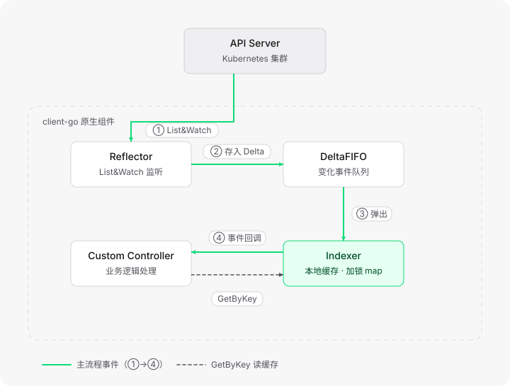

## 简介
**client-go**：Kubernetes 官方提供的 Go 语言客户端库，用于访问 Kubernetes API Server，实现对 K8s 资源（包括 CRD 自定义资源）的增删改查。它是所有 K8s 周边工具的"地基"——kubectl、Operator、Prometheus 的 k8s 监控、CI/CD 工具底层都在用它。

其实对 K8s 的一切操作，本质都是对 API Server 的 REST 请求：
client-go 做的事情，就是把这套交互封装成 SDK：鉴权处理、请求参数构造、JSON 到 Go 结构体的转换（Unmarshaling）都不用自己写，直接调方法即可。

### API Group：资源的两大分区
K8s 的 API 按"组"来组织，分两类：
- **Core API（核心组）**：最底层的基础资源，URL 以 `/api/v1/` 开头。包含 namespace、pods、nodes、configmap、secrets、pv、pvc、service、endpoints 等；
- **Named API（命名组）**：按功能领域划分的组，URL 以 `/apis/<group>/<version>/` 开头。比如 apps 组（deployments、replicasets、statefulsets）、networking 组（networkpolicies）。命名组还带版本化管理（v1、v1beta1 等），方便演进。

两个典型请求对比：
```
# Core API：获取 namespaces，URL 结构 /api/<version>/<resource>
https://127.0.0.1:62306/api/v1/namespaces?limit=500

# Named API：获取 deployments，URL 结构 /apis/<group>/<version>/namespaces/<namespace>/<resource>
https://127.0.0.1:62306/apis/apps/v1/namespaces/default/deployments?limit=500
```
调试技巧：执行 `kubectl get -v6`，能看到 kubectl 实际请求的 API 端点。

### kubectl 命令的底层原理
kubectl 本身就是用 client-go 写的。执行一条 `kubectl get pods`，背后流程是这样的：
```
kubectl get pods
      │
      ▼
① 加载 kubeconfig 配置（集群地址、证书、Token）
      │
      ▼
② 构建 rest.Config 对象
      │
      ▼
③ 创建 clientset 客户端
      │
      ▼
④ 按资源所属组调用：clientset.CoreV1().Pods("default").List()
      │
      ▼
⑤ 拼出 REST 请求：GET /api/v1/namespaces/default/pods
      │
      ▼
⑥ API Server 处理 → 返回 JSON → 反序列化为 Go 结构体 → 格式化输出
```
代码上对应的就是这几行：
```go
// config里面记录着访问API Server 所需的全部信息，kubeconfig 文件（YAML）里写的内容，经过`BuildConfigFromFlags` 解析后就装进这个结构体
config, err := clientcmd.BuildConfigFromFlags("", kubeconfigPath)
// 创建 clientset
clientset, err := kubernetes.NewForConfig(config)
// 按组调用：Core API 组用 CoreV1()，命名组用 AppsV1()
pods, err := clientset.CoreV1().Pods("default").List(ctx, metav1.ListOptions{})
deployments, err := clientset.AppsV1().Deployments("default").List(ctx, metav1.ListOptions{})
```
可以看到 clientset 的调用方法和 API 分组一一对应：Core API 组走 `clientset.CoreV1()`，命名组走 `clientset.AppsV1()` 等。   
所以理解了 client-go，就理解了 kubectl：**kubectl 只是 client-go 的一层命令行外壳，任何 Go 程序引入 client-go，都能拥有和 kubectl 一样的操作 K8s 的能力**
### GVK和GVR
- GVK是`group`,`version`,`kind`,yaml文件描述资源用的字段。
- GVR是`group`,`version`,`resource`,REST API的URL路径。
- client-go需要将GVK转换成GVR然后才能发rest请求给apiserver.


## 四种client-go
client-go 其实不是一个"客户端"，而是四种，封装程度从低到高：
| 客户端          | 定位                       | 能操作的资源            | 返回类型                     |
| --------------- | -------------------------- | ----------------------- | ---------------------------- |
| RestClient      | 最底层，直接发 REST 请求   | 任意资源                | `*Request`（自行反序列化）   |
| ClientSet       | 上层封装，按资源组划分方法 | 仅内置标准资源          | 强类型结构体（如 `PodList`） |
| DynamicClient   | 动态客户端，类似"泛型"     | 任意资源（含 CRD）      | `Unstructured`（map）        |
| DiscoveryClient | 发现客户端                 | 不操作资源，查 API 能力 | Group/Version/Resource 信息  |

### RestClient：最底层的 REST 客户端
RestClient 直接与 API Server 进行 REST 交互，提供 `Post()`、`Put()`、`Get()`、`Delete()` 等基础 HTTP 方法，所有方法都返回 `*Request` 指针用于链式构建请求。用它的代价是：API 路径、版本、编解码器都得自己配。

```go
config := &rest.Config{
    Host: "https://127.0.0.1:62306",
    // 三个必配项
    APIPath: "/api",                                          // 指定 API 路径
    GroupVersion: &corev1.SchemeGroupVersion,                 // 指定组/版本
    NegotiatedSerializer: scheme.Codecs.WithoutConversion(),  // 指定编解码器
}
restClient, err := rest.RESTClientFor(config)

// 链式构建请求：GET /api/v1/namespaces/kube-system/pods?limit=100
podList := &corev1.PodList{}   // 用结构体接收结果
err = restClient.Get().
    Namespace("kube-system").
    Resource("pods").
    VersionedParams(&metav1.ListOptions{Limit: 100}, scheme.ParameterCodec).
    Do(context.TODO()).
    Into(podList)   // Do() 执行请求，Into() 把 JSON 反序列化进结构体

for _, pod := range podList.Items {
    fmt.Println(pod.Name, pod.Status.Phase)
}
```
特点：完全等价于一条 `kubectl get pods -n kube-system` 的原始 HTTP 请求，同样支持 Create/Update/Delete 全套 CRUD，但用起来最繁琐——这正是 ClientSet 存在的原因。

### ClientSet：标准资源的易用封装
ClientSet 是最常用的客户端，它把 RestClient 封装成了"按 API 组划分"的方法集，接口定义在 [clientset.go](https://github.com/kubernetes/client-go/blob/master/kubernetes/clientset.go) 里，包含了 Discovery 接口和所有内置 API 组（`AppsV1`、`CoreV1`、`StorageV1` 等）。

接口层级是这样组织的：**分组接口 → Getter → 资源接口**：

```go
clientset, err := kubernetes.NewForConfig(config)

// 层级：ClientSet → CoreV1()（分组接口）→ Pods(ns)（Getter）→ List()（PodInterface 的方法）
pods, err := clientset.CoreV1().Pods("default").List(ctx, metav1.ListOptions{})
//      ClientSet → AppsV1() → Deployments(ns) → List()
deploys, err := clientset.AppsV1().Deployments("default").List(ctx, metav1.ListOptions{})
```

创建资源时需要构建完整的强类型结构体：

```go
deployment := &appsv1.Deployment{
    ObjectMeta: metav1.ObjectMeta{Name: "nginx", Namespace: "default"},
    Spec: appsv1.DeploymentSpec{
        // 注意：Replicas 是 *int32，必须用指针
        Replicas: int32Ptr(1),
        Selector: &metav1.LabelSelector{MatchLabels: map[string]string{"app": "nginx"}},
        Template: v1.PodTemplateSpec{ /* Pod 模板：containers、ports 等 */ },
    },
}
//资源已存在会返回 AlreadyExists 冲突错误。
_, err = clientset.AppsV1().Deployments("default").Create(ctx, deployment, metav1.CreateOptions{})
```
**最大限制：ClientSet 不支持 CRD**——它是编译期写死的强类型接口，自定义资源没有对应的结构体和方法。要操作 CRD，就得用下面的 DynamicClient。

### DynamicClient：操作任意资源的"泛型"客户端
DynamicClient 能操作任何 K8s 资源（包括 CRD），代价是**所有返回都是 `Unstructured` 类型**——内部用 `map[string]interface{}` 存数据，没有类型安全，取字段得靠字符串路径。

```go
dynamicClient, err := dynamic.NewForConfig(config)

// 必须用 GVR 指定资源（不再是 CoreV1() 这种强类型方法）
gvr := schema.GroupVersionResource{Group: "", Version: "v1", Resource: "pods"}
list, err := dynamicClient.Resource(gvr).Namespace("kube-system").List(ctx, metav1.ListOptions{})
```

它最典型的用法是**从 YAML 直接创建资源，类似 kubectl apply**，完整流程：

```go
// 1. 用 go:embed 把 YAML 嵌入程序（生产环境可直接读文件）
//go:embed deployment.yaml
var deployYaml string

// 2. 把 YAML 解析成 Unstructured 对象（本质是一层层嵌套的 map）
deployObj := &unstructured.Unstructured{}
yaml.Unmarshal([]byte(deployYaml), deployObj)

// 3. 从对象里提取 apiVersion 和 kind
apiVersion, found, _ := unstructured.NestedString(deployObj.Object, "apiVersion") // "apps/v1"
kind, _, _ := unstructured.NestedString(deployObj.Object, "kind")                 // "Deployment"

// 4. 拼出 GVR：按 "/" 分割 apiVersion，长度为 2 则 [0]=Group [1]=Version，长度为 1 则是核心组（Group 为空）
gv := strings.Split(apiVersion, "/")

// 5. kind 转成复数形式的 resource（Deployment → deployments）
resource := mapKindToResource(kind)

gvr := schema.GroupVersionResource{Group: gv[0], Version: gv[1], Resource: resource}

// 6. 发起创建
_, err = dynamicClient.Resource(gvr).Namespace("default").Create(ctx, deployObj, v1.CreateOptions{})
```
适用场景：通用工具类程序（要处理任意资源）、动态应用 YAML、操作 CRD。如果只操作固定的标准资源，还是用 ClientSet 更舒服。

### DiscoveryClient：查询 API Server "有什么"
前三个客户端都是"操作资源"，DiscoveryClient 不操作资源，而是**发现 API Server 支持哪些 Group、Version、Resource**。`kubectl api-versions` 和 `kubectl api-resources` 两个命令的底层就是它。

它的价值在于：
- 支持自动发现 CRD 资源；
- 适配不同 K8s 集群版本的资源差异（新版有而旧版没有的资源）；
- **带本地缓存**：查询过的 API 信息缓存在 `~/.kube/cache/discovery/<集群地址_端口>/` 目录下，以 JSON 格式存储（如 `servergroups.json`），避免频繁请求 API Server。
缓存里的每个资源定义包含丰富元数据：资源名称、单数名称、是否支持 namespace、支持的 verbs（create/delete/get/list...）、shortNames（如 `deploy`）等。

日常开发很少直接用 DiscoveryClient，它主要服务于 kubectl 这类通用工具的内部实现，但了解它有助于排查 API 兼容性问题。


## 常见组件介绍
前面四种客户端都只解决了"发请求"的问题，但控制器类程序（Operator、kube-controller-manager）需要**持续感知资源变化**——靠每次轮询发 List 请求既低效又给 API Server 压力大。这就是 Informer 组件包要解决的问题。
### Informer 架构：两大组件
Informer 架构分为两部分：



- **Reflector**：通过 List&Watch 机制与 API Server 通信，监听资源变化，把变化对象放进 DeltaFIFO；
- **DeltaFIFO**：先进先出队列，特殊在于队列里存的是 Delta（变化类型 + 对象）；
- **Indexer**：从队列弹出对象后存入线程安全的本地缓存（底层是加锁的 map），同时通过 EventHandler 把对象发给 Custom Controller 处理业务。

Custom Controller 从缓存读数据用的是 `GetByKey`，key 是 `namespace/name` 格式（如 `default/nginx`），由 `cache.MetaNamespaceKeyFunc` 生成。

### Reflector 与 DeltaFIFO
**Delta** 结构包含两样东西：
- **DeltaType（操作类型）**：四种——Add（增）、Delete（删）、Update（改）、Sync（同步，首次全量 List 时标记）；
- **Object**：`interface{}` 类型，装着资源对象本身。

DeltaFIFO 有个容易误解的实现细节：**队列里存的不是完整 Delta，而是 key**（`namespace/name`），真实的 Delta 数据存在旁边的 `map[string]Deltas` 里，通过 key 关联取回。这样同一个资源连续变更多次时会合并在同一个 key 下，天然去重。

### Indexer：本地缓存与索引
Indexer 的核心是给缓存加"索引"，四个组件的关系：

| 组件      | 类型                      | 作用                                   |
| --------- | ------------------------- | -------------------------------------- |
| Indexers  | `map[索引名]索引函数`     | 存"索引器名称 → IndexFunc"的映射       |
| IndexFunc | 函数                      | 计算对象的索引 key，默认是按 namespace |
| Indices   | `map[索引名]Index`        | 存"索引类型 → Index"的映射             |
| Index     | `map[索引key]对象key集合` | 实际的索引缓存（K/V）                  |

实际开发中不用纠结自定义索引，**`GetByKey` + 默认的 `MetaNamespaceKeyFunc` 就能满足大部分场景**——用 `namespace/name` 格式的 key 直接命中缓存对象，O(1) 速度。

### WorkQueue：三种队列
EventHandler 处理事件、把 key 交给 WorkQueue 后，Custom Controller 再从队列取出来干活。WorkQueue 有三种类型：

| 类型                    | 特点                                 | 场景           |
| ----------------------- | ------------------------------------ | -------------- |
| `Interface`             | 基础 FIFO 队列，支持去重             | 简单场景       |
| `DelayingInterface`     | 在延迟队列基础上，可设定入队延迟时间 | 延迟重试       |
| `RateLimitingInterface` | 在延迟队列基础上叠加限速，最常用     | 生产控制器标配 |

RateLimitingInterface 的杀手锏是**指数退避重试**：处理失败的 key 重新入队，重试间隔指数增长（1s → 2s → 4s...），既保证最终重试成功，又防止业务系统被突发流量打爆。基本方法就四个：`Add`（入队）、`Len`（长度）、`Get`（出队）、`Done`（标记处理完成）。

### 用 Informer 实现 Watch 的优势
不用 Informer，直接裸写 watch 也行，代码大概长这样：

```go
// 裸 watch：每次都要先 List 拿全量，再建立 Watch 监听增量
list, _ := clientset.CoreV1().Pods("").List(ctx, metav1.ListOptions{})
w, _ := clientset.CoreV1().Pods("").Watch(ctx, metav1.ListOptions{ResourceVersion: list.ResourceVersion})
for event := range w.ResultChan() {
    // 处理增删改事件
}
```

看着简单，但坑全在自己身上。换成 Informer，对比一下：

| 问题                   | 裸 Watch                                                         | Informer                                                                         |
| ---------------------- | ---------------------------------------------------------------- | -------------------------------------------------------------------------------- |
| **断线事件丢失**       | watch 连接一断，断线期间发生的变更全丢了，不知道丢哪些           | 重连后 Reflector 会先重新 List 全量同步（Sync Delta），自动补齐，**事件不丢**    |
| **重复连接压力**       | 重连、重 List 的逻辑全要自己写                                   | Reflector 内置重连和 List&Watch 循环                                             |
| **查询打爆 APIServer** | 每次查询资源都要发请求到 API Server，100 个控制器就是 100 倍压力 | 对象已缓存在本地 Indexer，**读操作走内存，O(1) 命中，零 API Server 压力**        |
| **事件洪峰**           | 批量删除 1000 个 Pod 时，1000 个事件瞬间砸进回调，处理慢就堆积   | DeltaFIFO 按 key 合并（同一 Pod 反复变更只留最新）+ WorkQueue 去重，**天然削峰** |
| **处理失败**           | 失败了事件就没了，自己写重试                                     | RateLimiting 队列支持指数退避重试                                                |

举个具体例子：控制器要处理"Pod 删除"事件，裸 watch 时网络抖动断线 10 秒，期间删了 5 个 Pod——这 5 个事件永远拿不回来了，控制器的状态和集群实际状态产生静默漂移，这类 Bug 极难排查。而 Informer 重连后自动全量 List，发现缓存里 5 个 Pod 没了，照样生成 5 条 Delete Delta 走完整流程。

一句话总结：**裸 Watch 只给了你一条"会断的事件流"，Informer 给的是"断线自愈 + 本地缓存 + 去重削峰 + 失败重试"的完整方案**——所以所有生产级控制器（包括 kube-controller-manager 自己）都构建在 Informer 之上。


## 实现一个简单的CRD
```yaml
#crd.yaml
apiVersion: apiextensions.k8s.io/v1
kind: CustomResourceDefinition
metadata:
  name: myresources.mygroup.example.com
spec:
  group: mygroup.example.com
  versions:
    - name: v1alpha1
      served: true
      storage: true
      schema:
        openAPIV3Schema:
          type: object
          properties:
            spec:
              type: object
              properties:
                field1:
                  type: string
                  description: First example field
                field2:
                  type: string
                  description: Second example field
            status:
              type: object
  scope: Namespaced
  names:
    plural: myresources
    singular: myresource
    kind: MyResource
    shortNames:
      - myres
```
```yaml
#myresource.yaml

apiVersion: mygroup.example.com/v1alpha1
kind: MyResource
metadata:
  name: my-resource-instance
  namespace: default
spec:
  field1: "ExampleValue1"
  field2: "ExampleValue2"
```
```go
// main.go
func main() {
	// 解析命令行参数
	if len(os.Args) != 3 {
		fmt.Printf("Usage: %s get <resource>\n", os.Args[0])
		os.Exit(1)
	}
	command := os.Args[1]
	kind := os.Args[2]

	if command != "get" {
		fmt.Println("Unsupported command:", command)
		os.Exit(1)
	}

	// 加载 kubeconfig 配置
	var kubeconfig *string
	if home := homedir.HomeDir(); home != "" {
		kubeconfig = flag.String("kubeconfig", filepath.Join(home, ".kube", "config"), "(optional) absolute path to the kubeconfig file")
	} else {
		kubeconfig = flag.String("kubeconfig", "", "absolute path to the kubeconfig file")
	}
	flag.Parse()

	config, err := clientcmd.BuildConfigFromFlags("", *kubeconfig)
	if err != nil {
		panic(err.Error())
	}

	// 创建 dynamic client
	dynamicClient, err := dynamic.NewForConfig(config)
	if err != nil {
		panic(err)
	}

	// 获取客户端和映射器
	clientset, err := kubernetes.NewForConfig(config)
	if err != nil {
		panic(err)
	}

	discoveryClient := clientset.Discovery()
	apiGroupResources, err := restmapper.GetAPIGroupResources(discoveryClient)
	if err != nil {
		panic(err)
	}

	mapper := restmapper.NewDiscoveryRESTMapper(apiGroupResources)

	// 动态映射 Kind 到 GVR
	// gvk := schema.FromAPIVersionAndKind("mygroup.example.com/v1alpha1", kind)
	// 还可以用这个方法
	gvk := schema.GroupVersionKind{
		Group:   "mygroup.example.com",
		Version: "v1alpha1",
		Kind:    kind,
	}

	mapping, err := mapper.RESTMapping(gvk.GroupKind(), gvk.Version)
	if err != nil {
		panic(err)
	}
	// mapping.Resource 就是 GVR，这样就实现 GVK->GVR 的转化

	// 获取资源
	resourceInterface := dynamicClient.Resource(mapping.Resource).Namespace("default")
	resources, err := resourceInterface.List(context.TODO(), metav1.ListOptions{})
	if err != nil {
		panic(err)
	}

	// 打印资源
	for _, resource := range resources.Items {
		fmt.Printf("Name: %s, Namespace: %s, UID: %s\n", resource.GetName(), resource.GetNamespace(), resource.GetUID())
	}
}
```
