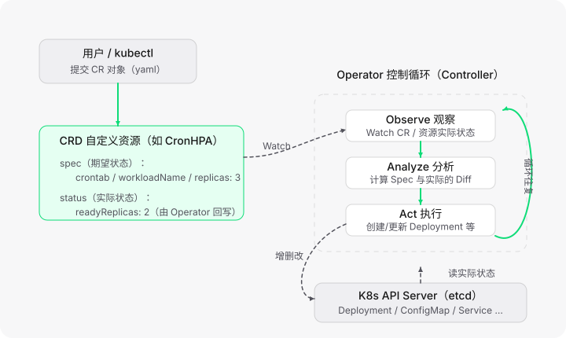
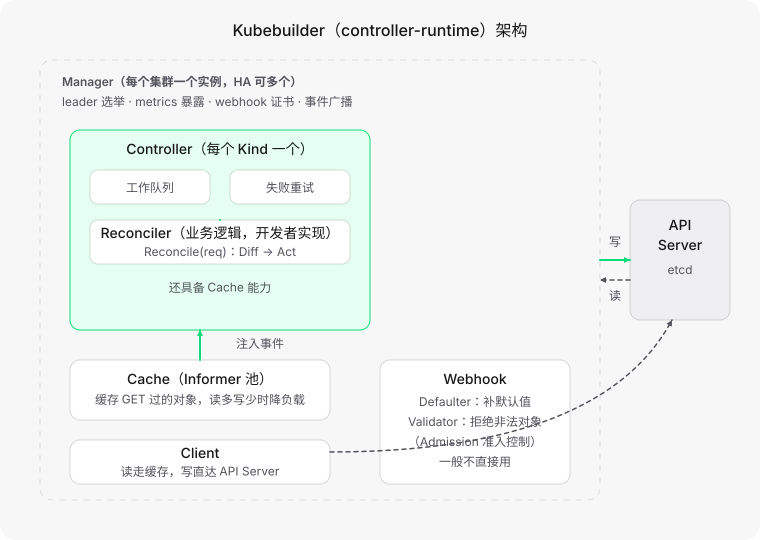
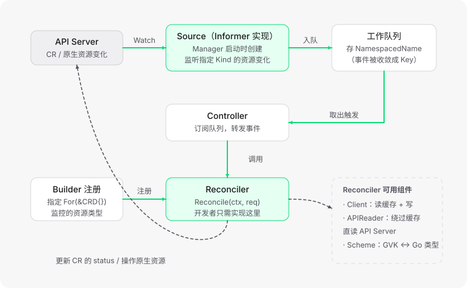
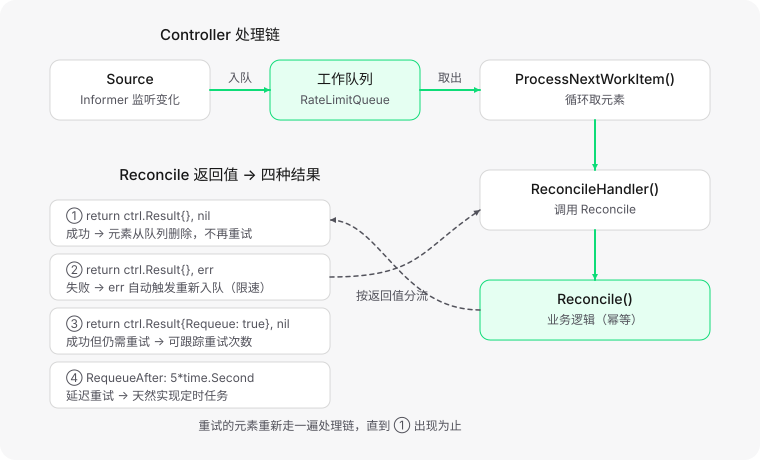

## 什么是 Operator

### 本质定义

Operator 是一种特殊的控制器（Controller），能够将控制循环机制应用到自定义资源（CRD）的状态管理中。

- 核心组成：**Operator = Controller + CRD**
- 工作流程：
  1. 监控（Watch）CRD 变更
  2. 根据 CRD 声明创建原生资源（如 Deployment/ConfigMap/Service 等）
  3. 通过控制循环（Control Loop）将操作结果更新到 status 字段




### 示例：Redis Operator 如何"翻译"声明

以部署一个 Redis 集群为例。用户只需提交一份 RedisCluster CR，声明期望状态即可：

```yaml
apiVersion: cache.example.com/v1
kind: RedisCluster
metadata:
  name: my-redis
spec:                      # 期望状态
  shards: 3                # 期望 3 个分片
  replicasPerShard: 1      # 每个分片 1 个副本
  image: redis:7.2         # 使用的 Redis 镜像
  storage: 10Gi            # 每个节点持久化存储大小
status:                    # 实际状态：由 Operator 回写
  phase: Ready
  readyShards: 3
```
Redis Operator 的工作过程正是上面三步的落地：
1. **Watch**：Operator 监听到 `my-redis` 这个 CR 被创建，读取其 `spec`（3 分片、10Gi 存储）
2. **创建原生资源**：Operator 调用 API Server，把 spec "翻译"成一组原生资源——创建 StatefulSet（拉起 3 个 Redis Pod）、ConfigMap（写入 redis.conf 集群模式配置）、Service（提供稳定的访问地址）
3. **回写 status**：Operator 持续检查实际运行的 Redis 节点数，确认 3 个分片全部就绪后，把 `status.phase` 更新为 `Ready`
关键点在于：**CR 本身只是数据，不会运行任何东西**；真正拉起 Pod 的是 StatefulSet 的内置控制器，Operator 只是那个把"用户的愿望"翻译成"原生资源"的中间人。若用户把 `spec.shards` 从 3 改成 5，控制循环会检测到差异，Operator 便修改 StatefulSet 的 `replicas` 进行扩容——全程无需人工介入。


## Operator 开发模式的好处
1. **控制循环复用**：直接复用 Controller 的控制循环逻辑，开发者无需自行实现复杂的控制循环机制，只需专注于业务逻辑代码的编写
2. **声明式资源管理**：继承 Kubernetes 原生的声明式资源管理能力，所有自定义资源（CRD）对象都存储在 etcd 中，可通过 kubectl 工具进行增删改查操作
3. **API 原生集成**：与 Kubernetes API 深度集成，支持通过 kubectl 直接管理自定义资源，实现与原生资源相同的操作体验
4. **有状态应用简化**：特别简化了有状态应用（如数据库、中间件等）的开发和管理流程，通过 CRD 声明即可部署完整实例
5. **平台能力继承**：自动获得 Kubernetes 平台提供的应用管理能力，包括自愈机制、滚动更新、自动重启等特性

## Operator 的使用场景
- **自定义资源定义**：支持定义各类业务资源，如数据库实例（Redis/Memcached/ClickHouse 等）、云资源（通过 Crossplane 定义 VPC、云数据库等）
- **自动化运维**：实现备份恢复等运维自动化任务，可针对 K8s 集群内任意资源设计自动化操作流程
- **CI/CD 工作流**：构建自定义的持续集成/持续部署流水线，将复杂的发布流程抽象为 CRD 资源
- **存储系统管理**：典型案例如 Rook、Ceph 等存储系统的 Operator 实现，通过声明式 API 管理分布式存储集群
- **云资源编排**：通过 Crossplane 等方案实现多云资源编排，声明云服务资源（如腾讯云 VPC、云数据库）即可自动创建对应资源

## Kubebuilder 和 Operator SDK

### Kubebuilder 介绍

- 官方框架：Kubernetes 官方提供的 Operator 开发框架
- 底层实现：基于 controller-runtime 和 controller-tools 这两个核心库构建
- 代码生成：内置了复杂的代码生成能力，简化 Operator 开发流程

### Operator SDK 及其与 Kubebuilder 的关系

- 底层依赖：Operator SDK 底层直接使用了 Kubebuilder 的代码生成能力
- 封装关系：可以理解为 Operator SDK 是对 Kubebuilder 的二次封装
- 开发语言：两者都支持使用 Golang 进行 Operator 开发

### Operator SDK 的额外能力

- **OLM 支持**：提供 Operator Lifecycle Manager（OLM），简化 Operator 打包和分发流程
- **发布中心**：内置 OperatorHub，类似 Docker Hub 的 Operator 发布平台
- **质量检测**：包含 scorecard 工具，确保开发过程符合最佳实践
- **多语言支持**：除 Golang 外，还支持基于 Ansible 脚本和 Helm chart 创建 Operator

### 生产环境中的选择

- 项目结构：两者生成的项目布局基本相同，没有本质区别
- 选择考量：生产环境中选择任一方都不会有显著差异
- 部署方式：Kubebuilder 需要将 Operator 包装成 Customized 或 Helm chart 部署

### Kubebuilder 的核心地位

- 基础地位：无论使用 Kubebuilder 还是 Operator SDK，本质上都是在使用 Kubebuilder
- 核心组件：提供 Operator 开发所需的核心功能和代码生成能力
- 统一标准：两种框架最终生成的 Operator 实现标准一致

## Kubebuilder 架构



- **Manager 核心功能**：初始化 Controller Manager，每个集群运行一个实例（HA 模式下可多个），负责处理 leader 选举、暴露 metrics、管理 webhook 证书、缓存事件、持有客户端连接和广播事件
- **Controller 特性**：具备 Cache、队列和失败重试能力，每个被协调的 Kind 对应一个 Controller 实例，内部封装 Reconciler 业务逻辑
- **Reconciler 定位**：开发者只需实现这部分业务逻辑，通过 Controller 调用，每次获取事件时触发
- **Client/Cache 使用**：这两个组件通常不直接使用，Client 负责与 API Server 通信并处理认证协议，Cache 缓存 GET 过的对象
- **Webhook 作用**：用于开发 AdmissionWebHook（准入控制器），包括 Defaulter（设置 spec 未定义字段）和 Validator（拒绝格式错误对象）

## Reconciler 架构



- **注册机制**：通过 Builder 注册到 Manager，注册时需要指定监控的资源类型（如 CRD 或 K8s 标准资源）
- **事件处理流程**：
  1. Manager 启动时创建 Source 组件（基于 Informer 实现）
  2. Source 监听资源变化并传递消息到工作队列
  3. Controller 订阅工作队列消息并转发给 Reconciler
- **核心组件交互**：
  - APIReader：直接读取 API Server（绕过 Cache）
  - Scheme：管理 GVK 与 Go 类型的映射
  - Client：包含读缓存和写 API Server 能力

### 触发机制

触发本质：从工作队列获取元素的过程，包含四种处理结果：

1. 成功无需重试：从队列删除
2. 失败需要重试：重新入队
3. 成功但需重试：标记 requeue
4. 延迟重试：设置 RequeueAfter

### 重试策略

```go
// 成功无重试
return ctrl.Result{}, nil

// 失败需重试：err 自动触发重新入队（带限速）
return ctrl.Result{}, err

// 成功需重试：可跟踪重试次数
return ctrl.Result{Requeue: true}, nil

// 延迟重试：实现定时任务
return ctrl.Result{RequeueAfter: 5 * time.Second}, nil
```

## Controller 架构



### 核心处理链

1. Source（Informer）监听资源变化并入队
2. `ProcessNextWorkItem()` 从队列取出元素
3. `ReconcileHandler()` 调用 Reconcile 方法
4. 结果处理：业务成功则元素从队列删除；业务失败则元素重新入队；支持延迟重试机制

### 实现细节

- 队列类型：使用 RateLimitQueue（与 client-go 实现类似）
- 关键配置：
  - `MaxConcurrentReconciles`：控制并发协调数
  - `CacheSyncTimeout`：缓存同步超时设置
  - `RecoverPanic`：异常恢复机制
- 自动生成：通过 kubebuilder 自动创建 main.go 中的基础组件

## 最佳实践

### Reconcile 最佳实践

- **事件无关性**：Reconcile 逻辑不应关注具体事件类型（创建/更新/删除），避免针对不同事件编写不同逻辑
- **幂等性设计**：无论运行多少次都应产生相同结果，因为事件可能因网络等原因被重复触发
- **状态驱动**：只需关注期望状态和当前状态的差异（Diff），基于状态差异执行业务逻辑

### Operator 端到端测试

#### 测试环境搭建

核心组件：使用 envtest.Environment 模拟 K8s API Server

```bash
go install sigs.k8s.io/controller-runtime/tools/setup-envtest@latest
setup-envtest use 1.28        # 获取二进制文件路径
# 创建软链接到标准目录 /usr/local/kubebuilder/bin
```

#### 测试用例编写

文件组织：

- `e2e_suite_test.go`：测试入口文件
- `e2e_test.go`：测试用例实现文件
- `cluster.go`：自定义测试逻辑文件

关键步骤：

1. 初始化 envtest 环境并加载 CRD
2. 注册自定义资源 Scheme
3. 创建 K8s 客户端
4. 编写资源创建/验证逻辑

#### 测试环境初始化

- 日志配置：使用 zap 日志库并开启开发模式
- CRD 加载：通过 CRDDirectoryPaths 指定 CRD 文件路径
- Scheme 注册：使用 AddToScheme 方法注册自定义 API 类型

#### 资源操作测试

- 资源创建：在测试中创建 CR 对象
- 资源获取：通过客户端读取并断言
- 字段验证：可验证 Spec/Status 等字段是否符合预期

#### envtest 特性与限制

核心特性：

- 无需真实 K8s 集群
- 包含 etcd 存储但无控制器
- 支持 CRUD 操作验证

主要限制：

- 不会实际创建 Pod 等工作负载
- 仅适用于 API 交互逻辑测试
- 需要手动模拟控制器行为
