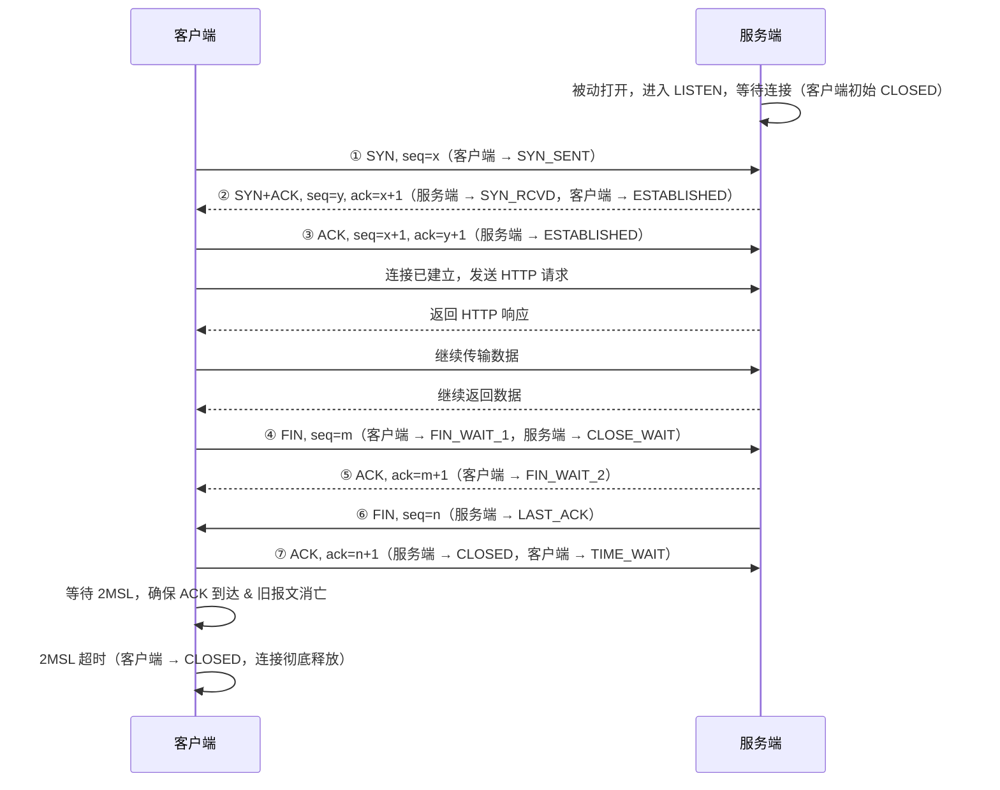
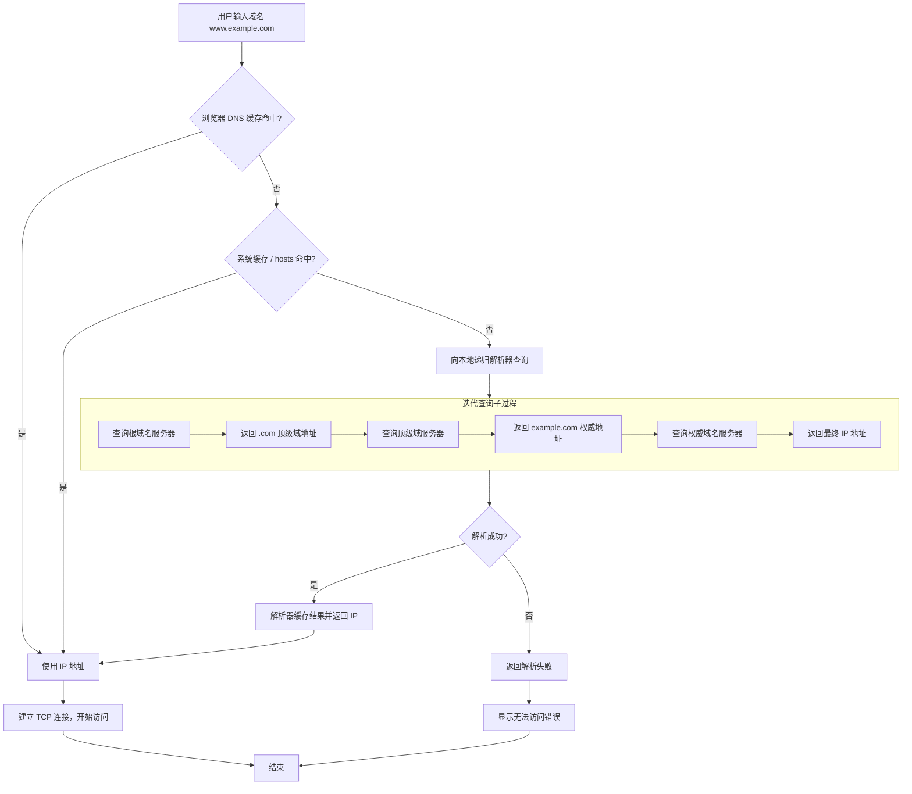

## 名词解释
`SYN`：同步标志，用于发起连接请求。客户端发送 SYN 报文告诉服务端想建立连接，同时携带初始序列号。  
        SYN 报文即使没带数据也消耗一个序列号，确认时需 ack = seq + 1。  
`seq`：序列号，TCP 把数据拆成字节流，每个字节有一个序号。初始序列号在握手时随机生成，后续按已发送的字节数累加。    
`ACK`：确认标志，表示确认号字段有效。连接建立后几乎所有报文都带 ACK 标志。  
        确认号告诉对方已成功接收的数据范围，期望对方下次从该序号开始发送。  
`ack`：确认号，配合 ACK 标志使用，值为期望收到对方下一个报文段的序列号。  
        收到 SYN 或 FIN 报文时 ack = 收到的 seq + 1，收到普通数据报文时 ack = seq + 数据长度。         
`FIN`：结束标志，用于请求关闭连接。表示本方已经没有数据要发送了，FIN 报文消耗一个序列号，确认时需 ack = seq + 1。挥手阶段双方各自发送一次 FIN。  
`RTT`: 数据包从发送出去到收到对方确认的一来一回耗时，直接影响重传超时（RTO）、拥塞控制节奏和握手/首字节延迟。  
`TTL`: IP 头里的字段，每经一个路由器转发减 1，减到 0 就被丢弃并回 ICMP Time Exceeded，用来防止数据包在网络里无限环路；实测中也被 traceroute 借来逐跳探测路径。

## 全局看待网络数据传输

### 发送过程
#### 应用层：构建 HTTP 请求报文，包含请求行、请求头、请求体。交给传输层处理。  
#### socket: 操作系统提供给应用层调用传输层（TCP/UDP）的编程接口，应用层通过 socket 与传输层交互。  
#### 传输层：（假设是采用tcp协议）TCP 将数据分段并封装 TCP 头部。源端口是系统随机分配的客户端端口，目标端口是 HTTPS 的 443。添加序列号用于可靠传输和重组。  
#### 网络层：IP 协议封装 IP 头部（超 MTU 时才分片）。源 IP 是客户端的 IP 地址，目标 IP 是服务器的 IP 地址。  
#### 数据链路层：以太网协议将数据封装以太网帧。源 MAC 是客户端的 MAC 地址，目标 MAC 是下一跳的 MAC 地址（同网段即目标主机，跨网段即网关/路由器）。  
#### 物理层：将数据转换为电信号发送出去。  

### 接收过程
#### 物理层：将电信号转换为数据。  
#### 数据链路层：以太网协议解析以太网帧。  
#### 网络层：IP 协议解析 IP 头部。  
#### 传输层：TCP 协议解析 TCP 头部。  
#### socket: 操作系统提供给应用层调用传输层的编程接口，把解封装后的数据交给应用层。  
#### 应用层：HTTP 协议解析 HTTP 响应报文。  

| 层级 | 封装后的数据单元 | 本层新增 |
| --- | --- | --- |
| 应用层 | `[HTTP 数据]` | 应用数据（HTTP 报文） |
| 传输层 | `[TCP 头(UDP) \| HTTP 数据]` | TCP 头 |
| 网络层 | `[IP 头 \| TCP 头 \| HTTP 数据]` | IP 头 |
| 数据链路层 | `[帧头 \| IP 头 \| TCP 头(UDP) \| HTTP 数据 \| CRC]` | 帧头 + CRC 校验 |
| 物理层 | `网卡 → 电信号/光信号 → 网线/光纤` | 转为比特流传输 |  
  
  
| 层级 | 涉及设备 / 组件 | 关键标识 / 处理对象 |
| --- | --- | --- |
| 应用层 | 浏览器 / 服务器 | 数据（HTTP 等应用协议报文） |
| 传输层 | TCP（UDP） 协议栈 | 端口号 |
| 网络层 | 路由器 | IP 地址 |
| 数据链路层 | 交换机、网卡 | MAC 地址 |
| 物理层 | 网卡、网线、光纤 | 电信号 / 光信号 |

### 补充ICMP
ICMP（网际控制报文协议）属于网络层（与 IP 同层，协议号 1），不传业务数据，专门传递错误报告和控制信息。它和 TCP(6)、UDP(17) 都直接承载在 IP 头里、由 IP 头 Protocol 字段区分，但从分层模型看 TCP/UDP 是传输层、ICMP 是网络层，比它们低一层——并非协议层级意义上的平级。  
`1`Ping：用 Echo Request / Reply 测连通性和 RTT。  
`2`Traceroute：靠 Time Exceeded（TTL 减到 0）逐跳探出路径。  
`3`Destination Unreachable：目的不可达，如 UDP 发到没监听的端口会回 port unreachable。  
`4`Redirect：路由器通知主机换更优下一跳。  
`补充`ICMP 自身带校验和；防火墙常限制它以防探测，但全禁会导致路径问题难排查。  

## 详解TCP过程

## arp协议
### 场景举例
`1`两台机器要在局域网内通信，必须知道对方的 MAC 地址。ARP 就是把 IP 地址解析成 MAC 地址的协议。  
`2`主机 A（192.168.1.10）要访问主机 B（192.168.1.20），但不知道 B 的 MAC 地址。A 在局域网内广播一个 ARP 请求包，源 IP 是自己，源 MAC 是自己，目标 IP 是 B，以太网帧目标 MAC 为广播地址 FF:FF:FF:FF:FF:FF，ARP 报文内目标 MAC 字段填 0（未知）。这个广播包局域网内所有设备都会收到。  
`3`B 收到后发现目标 IP 是自己，把 A 的 IP 和 MAC 记到自己的 ARP 缓存里，然后单播 ARP 应答包，里面包含 B 的 IP 和 MAC，直接发给 A。  
A 收到应答后把 B 的 IP 和 MAC 记到自己 ARP 缓存里。有了 MAC 地址，A 就可以封装以太网帧，目标 MAC 填 B 的地址，发送数据。  
`4`缓存有有效期，过期会重新发起 ARP 请求。跨网段通信时目标 MAC 填网关地址，由网关转发，目标 IP 还是最终目的地址，MAC 只负责同一网段内的下一跳。  
### 补充
`1`若A把目标 IP 和自己的子网掩码做与运算，发现目标不在同一网段，则决定走网关。  
`2`A查看路由表知道目标网关的地址，封装以太网帧，目标 MAC 填网关的 MAC 地址，发送数据。  
`3`网关收到数据后，解封装到网络层，查路由表得到下一跳 IP 和出接口，通过 ARP 解析下一跳 MAC，重新封装帧（源 MAC 改为本网关出接口 MAC，目标 MAC 填下一跳 MAC），从出接口转发给下一跳。  
`4`直到路由器查路由表发现目标网段直连在自己的某个接口上（即自己是最后一跳），如果目标 IP 不是自己且 ARP 缓存中没有该 IP-MAC 映射，则通过 ARP 解析目标 MAC，将数据发给目标机器。  
`5`消息的回传机制和上述一致。  

## DNS解析域名过程

## FAQ
### 如何验证数据包的准确性
`链路层`：CRC 校验，校验失败直接丢帧。
`IP 层`：IP 头部校验和，仅校验 IP 头，错误丢弃（IPv6 已取消 IP 头部校验和，交由上层负责）。
`TCP 层`：TCP 校验和（含伪头部、头 + 数据），校验不一致丢包重传。（UDP协议中可以不校验，但在ipv6中强制校验）
### seq的作用
TCP 把大数据拆成多个报文段，seq 标记每个片段位置；接收端按 seq 顺序拼回完整数据。  
重复到达的报文，接收端通过 seq 识别，直接丢弃重复数据，不重复交付应用。  
接收方根据接收到的数据包 seq 是否落在接收窗口内，判断该报文是否为旧报文（落在窗口左侧之外即旧报文，直接丢弃）。  
### 如何识别旧包 / 无归属报文
内核拿到 TCP 报文，先提取四元组查连接表：
`1`找不到匹配的已建立连接 / 半连接（半连接状态主要等待第三次握手的 ACK），判定是无归属的旧数据包，直接丢弃并回复 RST；
`2`有匹配连接时先校验 TCP 校验和，出错直接丢包；校验无误再校验 SEQ，序号不在接收窗口则丢弃报文。
### TIME_WAIT状态作用
`1`确保被动关闭方能收到最后的 ACK：若该 ACK 丢失，被动关闭方（处于 LAST_ACK）会重发 FIN；若主动关闭方此时已关闭（即没等 2MSL），收到重发 FIN 会回 RST 强行终止，导致被动关闭方异常关闭、上层收到 RST 错误而非正常 EOF。  
`2`：主动关闭方等待 2MSL，确保网络里所有属于旧连接的报文（数据、FIN、ACK） 全部超时消失；  
在 2MSL 周期内，操作系统禁止复用相同四元组创建新 TCP 连接，从根源杜绝所有旧报文干扰新连接，不区分报文类型。
### 什么是短连接，对比长连接
`1`短连接：建立连接 → 传输数据 → 关闭连接，用完即断、不复用。注意「短」是应用层的用法策略，而非 TCP 协议限制——连接建立后本可传任意多数据，是应用主动选择交互完即 close。  
`2`长连接：连接建立后保持打开，多次业务交互复用同一条连接，靠 keep-alive 或心跳保活，避免反复握手。  
`3`HTTP 语境：HTTP/1.0 默认短连接，一个 TCP 连接承载一个请求-响应对、响应回来就关；HTTP/1.1 默认长连接（keep-alive），同一条连接可串发多个请求，仅当带 `Connection: close` 或服务端超时/限流回收时才关闭。  
`4`核心对比：

| 维度 | 短连接 | 长连接 |
| --- | --- | --- |
| 连接生命周期 | 一次交互完即关闭 | 保持打开，多次交互复用 |
| 握手/挥手开销 | 每次交互都要 | 建立一次，分摊到多次 |
| 拥塞状态复用 | 无，每次重新慢启动 | 可复用 cwnd、RTT 等 |
| 服务端资源占用 | 用完即释放 | 长期持有 fd、内存，需保活 |
| TIME_WAIT | 主动关闭方易堆积 | 关闭次数少，堆积少 |

### 为什么大部分高并发场景一般采用长连接
`1`短连接无法复用拥塞控制状态（拥塞窗口 cwnd、慢启动阈值 ssthresh、RTT 估算等），每次传输都要重新慢启动，拥塞窗口还没爬上来连接就关了，高频小请求吞吐低。  
`2`短连接每次通信都要完整三次握手 + 四次挥手，对于高频小请求，握手与挥手的延迟和 CPU 开销占比很高。
### 实际http1.1部署中，为什么是服务端主动关闭多
谁先发 FIN，谁就是主动关闭方（进 TIME_WAIT）。HTTP/1.1 部署里服务端先发 FIN 的原因有四点：    
`1`客户端默认 keep-alive，不主动关：HTTP/1.1 默认长连接，客户端（浏览器、HTTP 客户端库）拿到连接会放入连接池复用，发完一个请求、收完响应后并不 close，而是留着等下次用。客户端主动关闭的动机本来就弱。    
`2`短连接由 `Connection: close` 推给服务端关：即便客户端明确要短连接、在请求头带 `Connection: close`，在主流实现中服务端发完响应后会由自己先 close socket 发 FIN，主动关闭方是服务端。    
`3`长连接超时/限流由服务端回收：服务端设了 keepalive_timeout、max_requests、最大连接数等，连接空闲超时、请求数到上限或连接数吃紧时，是服务端主动淘汰、先发 FIN。  
`4`服务端承担资源管理职责：fd、内存、并发连接上限都在服务端，它最有动机也最有权力主动关掉「多余」连接。  
`补充`最有力的佐证：线上经典运维问题是「服务端 TIME_WAIT 堆积」——TIME_WAIT 只出现在主动关闭方一侧，服务端主动关闭多才会堆在服务端；解决办法正是开 SO_REUSEADDR/端口复用（注意：SO_REUSEADDR 主要解决服务端 bind 冲突，让主动关闭方复用 TIME_WAIT 四元组真正起作用的是 tcp_tw_reuse，需开启时间戳）、调大 tcp_max_tw_buckets、或推长连接减少关闭次数。若真是客户端关多，该堆积的就该是客户端了。  

### 客户端主动关闭多的情形
`1`通用 TCP 短连接（裸 RPC、一次性调用/脚本）：客户端是发起方，发完请求、收完响应最清楚「这次交互已结束」，于是由它主动 close socket 发 FIN。服务端只是被动响应、等对方来关。这是「客户端主动关闭多」最典型、最普遍的范围，与 HTTP 无关。  
`2`HTTP/1.1 下客户端读完响应后自行 close socket：客户端靠 Content-Length / chunked 精确判定响应已完整，既不发 `Connection: close` 头、也不等服务端先关，自己直接 close() 先发 FIN——此时主动关闭方是客户端。但这只是部分 HTTP 客户端库的实现选择，非协议强制，并非主流。  
`3`客户端进程退出 / 用户主动关闭：浏览器关标签页、客户端进程崩溃或被杀死，操作系统回收其 socket 发 FIN/RST，客户端成为主动关闭方。  
`4`客户端侧主动放弃连接：如客户端设了比服务端更短的空闲超时，或连接池主动逐出某条连接，由客户端先 close。  
`总结`「客户端主动关闭多」严格成立的是通用 TCP 短连接与客户端自行管理连接生命周期的情形；在 HTTP/1.1 标准语义和主流 Web 部署里，主动关闭方通常是服务端。  

### TCP 滑动窗口、拥塞控制是什么
`1`滑动窗口（流量控制）：接收方根据自己的接收能力通告一个接收窗口，发送方据此控制未确认数据的最大在途字节数，避免发太快压垮接收方。窗口随数据收发不断向前滑动，故称滑动窗口。  
`2`拥塞窗口（拥塞控制）：发送方自己感知网络拥塞程度，估算出一个拥塞窗口，避免一次性发太多导致网络拥堵。实际发送窗口 = min(接收窗口, 拥塞窗口)，两个窗口共同约束发送速率。这套测算的数值保存在当前 TCP 连接里。  
`3`新建连接刚建立时，TCP 不敢直接发大量数据，只能从小到大慢慢增加 cwnd，一点点试探网络承载能力，这个缓慢扩容的过程就是慢启动，有额外耗时、吞吐低。  
### 什么是孤儿连接
孤儿连接通常指对端已消失（断网、进程崩溃）但连接仍残留的状态。此时无法正常接收响应，服务端靠 keepalive 探测或重传超时后主动发送 RST/FIN 关闭。
### 长连接和短连接分别在什么场景使用
选型的本质，是权衡「连接复用收益」与「连接持有成本」。
`1`复用收益：每次复用一条已建立的连接，省去握手往返、避免拥塞窗口重新慢启动；复用越频繁，收益越大。  
`2`持有成本：长连接需要服务端长期占用文件描述符、内存，并靠心跳保活；连接越多、空闲越久，服务端开销越大，且存在连接泄露、优雅重启复杂等代价。  
`3`选长连接更合适的场景：  
　- 高频复用：同一对端反复通信（微服务 RPC、数据库访问、消息推送、实时 API）。  
　- 延迟敏感：希望省掉握手往返、降低首字节延迟（TTFB），不适合等业务来了再握手。  
　- 稳定的服务端之间通信：双方长期在线，连接可被持续复用，摊销成本极低。  
`4`选短连接更合适的场景：  
　- 请求稀疏低频：客户端偶尔连一次就走，复用价值低，留着长连接反而空耗服务端资源。  
　- 海量分散客户端、每端交互极少：服务端维持天文数字的长连接不现实（内存、fd、心跳开销），用短连接或「短 keep-alive」更实际。  
　- 一次性、无状态任务：临时脚本、定时单次调用，用完即走最干净。  
`5`典型取舍边界：误区是「高并发 = 一定用长连接」。准确说法是「高频复用同一连接的高并发」才适合长连接；  
若是海量分散、单端极少量交互的高并发，服务端撑不住那么多长连接，短连接反而更稳。  
短连接真正压垮高并发的，通常是主动关闭方堆积的 TIME_WAIT（端口/内存耗尽），而非握手本身。  
### UDP和TCP有哪些不同
| 对比维度 | UDP | TCP |
| --- | --- | --- |
| 连接 | 无连接，发前不握手 | 三次握手建立连接 |
| 可靠性 | 不保证送达、不重传、不保序 | 确认 / 重传 / 按 seq 重组 |
| 传输单位 | 面向数据报（按报文收发） | 面向字节流（无消息边界） |
| 流量控制 | 无 | 滑动窗口（rwnd） |
| 拥塞控制 | 无 | 拥塞窗口 cwnd + 慢启动 |
| 首部开销 | 固定 8 字节 | 至少 20 字节 |
| 校验和 | IPv4 可选（可置 0），IPv6 强制，错则丢弃 | 必选，错则重传 |
| 顺序保证 | 不保证 | 保证（按 seq 有序交付） |
| 状态维护 | 无连接状态 | 维护连接状态机（ESTABLISHED 等） |
| 速度 / 延迟 | 低延迟、轻量 | 有握手与重传开销 |
| 典型场景 | DNS、音视频、游戏、QUIC | Web、文件传输、RPC |
### DNS 过程采用的是 TCP 还是 UDP
`1`普通查询默认走 UDP（53 端口）：查询/响应都是一问一答的小报文，UDP 无握手开销、延迟低，最适合。传统 DNS 报文上限 512 字节，超出会被截断（TC 位置 1），客户端须改用 TCP 重发完整响应。  
`2`大响应 / 区域传送走 TCP：响应超过 UDP 容量（经 EDNS 扩展后可到 4096 字节，仍超限）、主从 DNS 做区域传送（AXFR/IXFR 同步整区数据）、DNSSEC 签名数据偏大，都必须用 TCP（可分段、保序、保可靠）。  
`3`加密 DNS 跑在 TCP 之上：DoT（DNS over TLS）、DoH（DNS over HTTPS）本就建立在 TCP/TLS 上，天然走 TCP。  
`4`现代实践：UDP 负责大多数快速查询，TCP 负责大报文、同步与加密；RFC 7766 已明确 DNS 可首选 TCP，服务端须同时支持两者。
### 粘包问题是什么，为什么UDP没有
**为什么TCP有粘包**：TCP 是字节流协议，不保留消息边界，消息是不断发往自己的缓冲区然后经过网络发到接收方的缓冲区的，所以接收方在某一次读取缓冲区数据的时候可能就直接一次性读取到了多条数据包粘在一起的数据。  
**为什么UDP没有** ：UDP是数据报协议，内核会按数据报为单位交付，不会把两个数据报拼在一起，也不会把一个数据报拆开（要么完整收到，要么整包丢失/截断）。  
**如何处理粘包** ： 消息头先写 4 字节表示后续 body 长度，接收方先读长度再读 body。
### TCP连接时，当发送的字节段有丢失时，接收方和发送方将如何处理
正常情况，接收方回的 ACK = 期望收到的下一个字节序号。只要数据连续到达，ACK 就一路往前推。  
**前置知识** ：最大报文段大小（MSS）在三次握手时通过 TCP 头部的 Options 字段互相通告。  
MSS = MTU -IP头大小-TCP头大小。以太网 MTU 一般 1500 → 常见 MSS = 1460 字节。  
但是实际的发送受到 滑动窗口、拥塞控制的限制，当MSS超出时，发送方会按 MSS 切成多个段，在窗口允许范围内连续发出。连接刚建立时 cwnd 很小（如 10×MSS 或 1×MSS，看实现），所以早期一次只能发很少；之后慢启动指数增长。所以seq的推进步长为该段实际携带的数据字节数。  
**如何解决**： 接收方在接收数据时内部会维护一个接收缓冲区，当有一部分seq序列号的数据处于空洞状态，假设是101-200，那么接收方就会向发送方发送ack=101,当连发三次后，发送方就会重发101-200的数据包。

