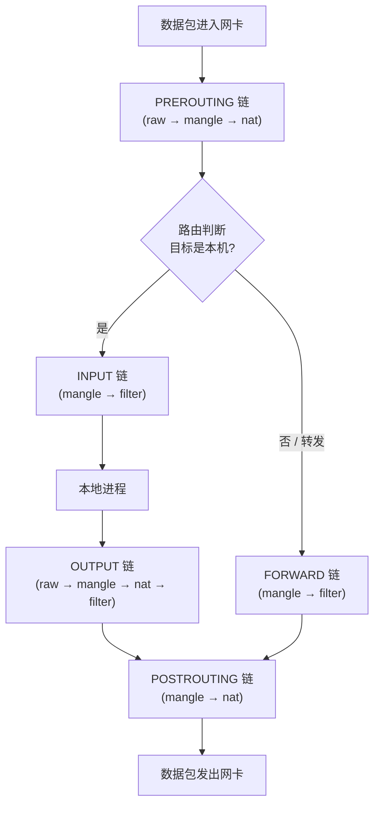

## 防火墙的定位
防火墙本质是一道「访问控制」屏障，工作在网络边界或主机边界，依据预设规则对流量做**过滤、转发、NAT**。按工作层次可分为：  
`1`包过滤（网络层 / 传输层）：基于源 / 目的 IP、端口、协议判断放行或丢弃，Linux 的 netfilter/iptables/firewalld 主要做这一层。    
`2`状态检测：跟踪连接状态，只放行属于已建立合法连接的数据包，而非孤立地看每个包。    
`3`应用层代理 / WAF：理解应用协议内容（如 HTTP、SQL），做更细的语义级防护。  

核心作用：隔离内外网、收敛暴露面、阻断非法访问、审计与告警。实际部署中，它通常和网络中的**软件防火墙（主机侧）**与**硬件防火墙（边界设备）**分层配合。

## firewalld 简单操作
firewalld 是 Linux 上 iptables/nftables 的「前端」：用 zone（区域）+ service（服务）的概念把规则管理变简单，底层默认交给 nftables 执行。常用命令如下：

```bash
# 启动并设为开机自启
systemctl start firewalld
systemctl enable firewalld

# 查看状态
firewall-cmd --state
firewall-cmd --get-active-zones      # 看哪些网卡属于哪个 zone
firewall-cmd --list-all              # 列出默认 zone 的全部规则
firewall-cmd --zone=public --list-all

# 放行服务（--permanent 表示写入永久配置，否则重启失效）
firewall-cmd --zone=public --add-service=http --permanent
firewall-cmd --zone=public --add-service=https --permanent

# 放行端口
firewall-cmd --zone=public --add-port=8080/tcp --permanent
firewall-cmd --zone=public --add-port=53/udp --permanent

# 移除 / 查询
firewall-cmd --zone=public --remove-service=http --permanent
firewall-cmd --zone=public --query-port=8080/tcp

# 修改后必须 reload 才能生效（永久配置需 reload 应用）
firewall-cmd --reload

# 设置默认 zone 与网卡绑定
firewall-cmd --set-default-zone=public
firewall-cmd --zone=public --change-interface=eth0 --permanent
```

## 四表五链（netfilter 包处理流程）
Linux 内核的 netfilter 框架挂着「四表五链」，规则按表、链挂载。**表**决定「做什么动作」，**链**决定「在哪个时机生效」。  



表与链的可挂载关系：

| 表（table） | 作用 | 可挂载的链 |
| --- | --- | --- |
| raw | 连接跟踪前处理（标记 NOTRACK） | PREROUTING、OUTPUT |
| mangle | 修改报文（TOS、TTL、MARK 等） | 全部五链 |
| nat | 地址转换（SNAT / DNAT） | PREROUTING、OUTPUT、POSTROUTING（INPUT 部分可） |
| filter | 包过滤（最常用、默认表） | INPUT、FORWARD、OUTPUT |

五个链的含义：
`PREROUTING` 路由判断前；`INPUT` 发往本机；`FORWARD` 本机转发；`OUTPUT` 本机发出；`POSTROUTING` 路由判断后、发出前。

## 为什么一般很少手动加防火墙规则
实际生产里，业务服务器上**很少人去堆 iptables/firewalld 规则**，核心原因是「代价」：  
`1`规则过多会严重拉低转发速率：软件防火墙是**逐条匹配**的，每个数据包都要从头遍历规则链。规则越膨胀，单包处理的 CPU 开销越大，单位时间能转发的包数（pps）明显下降，直接拖累业务吞吐。  
`2`复杂度骤升、难维护：规则一多，增删改查都容易出错，排障时很难看清到底哪条在生效，一旦配错还可能把自己挡在门外（连 SSH 都上不去）。    
`3`因此主机侧只留「最小必要规则」：通常只开放必要端口、限制管理来源 IP，保持链短而精，把匹配开销压到最低。  
`4`繁重的过滤交给硬件防火墙 / 云安全组：边界专用设备（Palo Alto、Fortinet、华为/思科，或云安全组 / ACL）用专用 ASIC 做线速转发与 DPI、IPS，规则再多也不消耗业务服务器 CPU，还能集中管理。  

一句话：**少写规则是为了保住转发性能、压住运维复杂度；重活交给有硬件加速的边界防火墙去干。**
