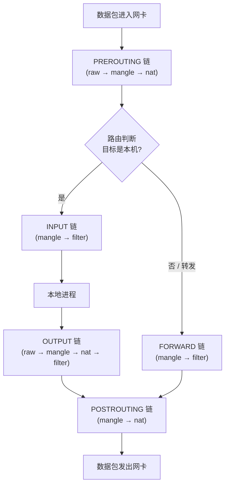

## 防火墙的定位
防火墙本质是一道「访问控制」屏障，工作在网络边界或主机边界，依据预设规则对流量做**过滤、转发、NAT**。按工作层次可分为：  
`1`包过滤（网络层 / 传输层）：基于源 / 目的 IP、端口、协议判断放行或丢弃，Linux 的 netfilter/iptables/firewalld 主要做这一层。    
`2`状态检测：跟踪连接状态，只放行属于已建立合法连接的数据包，而非孤立地看每个包。    
`3`应用层代理 / WAF：理解应用协议内容（如 HTTP、SQL），做更细的语义级防护。  
核心作用：隔离内外网、收敛暴露面、阻断非法访问、审计与告警。实际部署中，它通常和网络中的**软件防火墙（主机侧）**与**硬件防火墙（边界设备）**分层配合。

## firewalld 简单操作
firewalld 是 Linux 上 iptables（老版）/nftables 的「前端」：用 zone（区域）+ service（服务）的概念把规则管理变简单，底层默认交给 nftables 执行。常用命令如下：
```bash
# 启动并设为开机自启
systemctl start firewalld
systemctl enable firewalld

# 查看状态
firewall-cmd --state
firewall-cmd --list-all              # 列出默认 zone 的全部规则
firewall-cmd --zone=public --list-all

# 放行服务（--permanent 表示写入永久配置，否则重启失效）
firewall-cmd --zone=public --add-service=http --permanent
firewall-cmd --zone=public --add-service=https --permanent

# 放行端口
firewall-cmd --zone=public --add-port=8080/tcp --permanent
firewall-cmd --zone=public --add-port=53/udp --permanent

# 移除 / 查询
firewall-cmd --zone=public --remove-service=http --permanent
firewall-cmd --zone=public --query-port=8080/tcp

# 修改后必须 reload 才能生效（永久配置需 reload 应用）
firewall-cmd --reload

# 设置默认 zone 与网卡绑定
firewall-cmd --set-default-zone=public
firewall-cmd --zone=public --change-interface=eth0 --permanent
```
### zone（区域）+ service（服务）的设计
**zone＝「信任等级」的抽象**：按可信度把来源分组，每张网卡同一时刻只属于一个 zone（默认 `public`），各 zone 独立维护放行规则。常见区域：
| zone | 信任度 | 典型用途 |
| --- | --- | --- |
| `trusted` | 最高 | 内网 / 管理网，全部放行 |
| `internal` / `home` | 高 | 办公网 / 家庭网 |
| `public`（默认） | 低 | 公网，仅放行显式声明的服务 |
| `drop` / `block` | 无 | 直接丢弃 / 拒绝 |
**service＝「端口 + 协议」的命名**：如 `http`=80/tcp、`https`=443/tcp、`ssh`=22/tcp，用名字代替裸端口，语义清晰、可复用；自定义服务写到 `/etc/firewalld/services/`。
一句话：**zone 决定「谁」能进（来源），service 决定「什么」能进（业务）**，二者组合即表达"对哪张网卡放行哪些服务"，把规则从"面向数据包"升级为"面向业务"，易读也易维护。
**举例**：一台 Web 服务器，内网网卡 `eth1` 绑定 `trusted`（全放行），公网网卡 `eth0` 绑定 `public`（只开 Web 服务）：
```bash
firewall-cmd --zone=trusted --add-interface=eth1 --permanent   # 内网：信任度高，默认全放行
firewall-cmd --zone=public  --add-interface=eth0 --permanent   # 公网：只放行声明的服务
firewall-cmd --zone=public  --add-service=http  --permanent
firewall-cmd --zone=public  --add-service=https --permanent
firewall-cmd --reload
```
效果：内网访问不受限；公网仅放行 80/443，其余一律丢弃。


## nftables
nftables 是 Linux 内核的新一代**包过滤框架**，统一替代旧的 iptables / ip6tables / arptables / ebtables 四套工具。firewalld 的 zone/service 意图最终就是翻译成 nftables 规则下发。  
核心概念只有三个：**表（table）**= 命名空间、**链（chain）**= 挂到钩子上的时机、**规则（rule）**= `条件 动作`。  
```bash
# 建表 → 建链挂到 input 钩子 → 加规则
nft add table inet filter
nft add chain inet filter input { type filter hook input priority 0;}
nft add rule inet filter input tcp dport 22 accept
#查看完整规则集，并不做DNS解析
nft -n list ruleset
```
### 与 netfilter 的关系
netfilter 是内核网络栈的**钩子框架**（五链检查点），nftables 是挂在其上的**规则引擎**（表达与执行规则）——它替代的是 iptables，不是 netfilter。  
```text
用户配置（firewalld / nft 命令）
   ↓ 翻译
nftables 规则集（表 + 链 + 规则）
   ↓ 挂载
netfilter 钩子（五链） → 数据包经过时按规则处理
```
一句话：**netfilter 提供「在哪检查」，nftables 决定「检查什么、怎么处理」；五链属于 netfilter，nftables 用自己的表 / 链挂上去。**
**钩子** ：可以理解成内核网络栈里预埋的"挂钩点 / 检查站"——数据包经过这些点时，会被"挂住"停下来，让规则看一眼再放行。

## 四表五链（netfilter 包处理流程）
netfilter 框架在内核里提供五个固定钩子（五链）；「四表」是 iptables 对规则的组织方式（nftables 下改为自定义表，钩子不变）。**表**决定规则属于哪类处理（过滤 / NAT / 修改 / 跟踪），**链**决定「在哪个时机生效」。  

表与链的可挂载关系：
| 表（table） | 作用 | 可挂载的链 |
| --- | --- | --- |
| raw | 连接跟踪前处理（标记 NOTRACK） | PREROUTING、OUTPUT |
| mangle | 修改报文（TOS、TTL、MARK 等） | 全部五链 |
| nat | 地址转换（SNAT / DNAT） | PREROUTING、INPUT、OUTPUT、POSTROUTING |
| filter | 包过滤（最常用、默认表） | INPUT、FORWARD、OUTPUT |
五个链的含义：
`PREROUTING` 路由判断前；`INPUT` 发往本机；`FORWARD` 本机转发；`OUTPUT` 本机发出；`POSTROUTING` 路由判断后、发出前。
注：五链是内核事实，iptables / nftables 都挂在上面；nftables 只是把「四表」换成自定义表 + 优先级来挂链。


## 为什么一般很少手动加防火墙规则
实际生产里，业务服务器上**很少人去堆 iptables/firewalld 规则**，核心原因是「代价」：  
`1`规则过多会严重拉低转发速率：软件防火墙是**逐条匹配**的，每个数据包都要从头遍历规则链。规则越膨胀，单包处理的 CPU 开销越大，单位时间能转发的包数（pps）明显下降，直接拖累业务吞吐。  
`2`复杂度骤升、难维护：规则一多，增删改查都容易出错，排障时很难看清到底哪条在生效，一旦配错还可能把自己挡在门外（连 SSH 都上不去）。    
`3`因此主机侧只留「最小必要规则」：通常只开放必要端口、限制管理来源 IP，保持链短而精，把匹配开销压到最低。  
`4`繁重的过滤交给硬件防火墙 / 云安全组：边界专用设备（Palo Alto、Fortinet、华为/思科，或云安全组 / ACL）用专用 ASIC 做线速转发与 DPI、IPS，规则再多也不消耗业务服务器 CPU，还能集中管理。  

一句话：**少写规则是为了保住转发性能、压住运维复杂度；重活交给有硬件加速的边界防火墙去干。**
